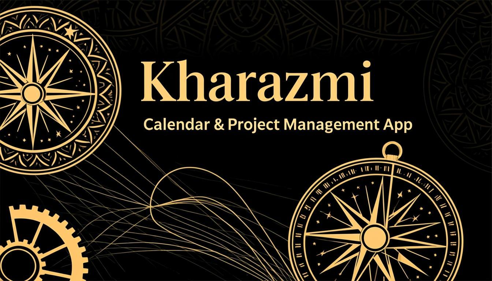

<div dir="rtl" align="center">

<br/>



<br/>

# خوارزمی 🕌

### تقویم شمسی · مدیریت پروژه · برنامه‌ریزی هوش مصنوعی

[](https://python.org)
[](https://doc.qt.io/qtforpython-6/)
[](LICENSE)
[
[](https://z.ai)

<br/>

**خوارزمی** یک برنامه دسکتاپ حرفه‌ای برای تقویم شمسی، مدیریت پروژه و برنامه‌ریزی هوشمند با هوش مصنوعی است. این نرم‌افزار با الهام از نام بزرگ‌ترین دانشمند ریاضیات ایران، **محمد بن موسی خوارزمی**، طراحی شده و ترکیبی از سنت و تکنولوژی مدرن را ارائه می‌دهد.

<br/>


<br/><br/>

---

<br/>

## ✨ ویژگی‌ها

<table>
<tr>
<td width="50%">

### 📅 تقویم شمسی
- تقویم کامل شمسی (جلالی) با تبدیل خودکار
- نمایش تعطیلات رسمی و مناسبت‌های ایرانی
- نماها: ماهانه، سالانه، هفتگی، خط زمانی و شبکه زمانی
- پشتیبانی از تقویم گوگل
- رویدادهای تکرارشونده با قوانین پیشرفته
- ورود زبان طبیعی فارسی برای ایجاد رویداد

</td>
<td width="50%">

### 🤖 دستیار هوش مصنوعی (رَسک)
- تولید مسیرهای برنامه‌ریزی پیچیده با گراف متصل
- تحلیل ریسک و شبیه‌سازی مونت‌کارلو
- شکستن وظایف به زیرگام‌ها
- بازبرنامه‌ریزی هوشمند
- چت تعاملی با استریم پاسخ
- پیشنهادات خودکار بهبود مسیر

</td>
</tr>
<tr>
<td width="50%">

### 📊 مدیریت پروژه
- نمودار گانت حرفه‌ای
- نمای کانبان (ستون وضعیت)
- نمودار شبکه‌ای وظایف (گراف)
- خط زمانی و آمار
- مسیر بحرانی (CPM) و تحلیل PERT
- سطح‌بندی منابع
- تشخیص چرخه و مرتب‌سازی توپولوژیک

</td>
<td width="50%">

### 🎨 رابط کاربری
- تم تاریک طلایی لوکس
- پنل بازرس کناری
- پالت دستورات (Command Palette)
- نقشه کوچک (Minimap)
- تور معرفی تعاملی
- پنل کنسول و لاگ
- انعطاف‌پذیری کامل با Dock Widgets

</td>
</tr>
</table>

<br/>

---

<br/>

## 📅 تقویم شمسی

<p align="center">

</p>

خوارزمی دارای یک سیستم تقویم شمسی کامل و بومی‌سازی‌شده است:

| قابلیت | توضیح |
|--------|-------|
| 🗓 تقویم جلالی | تبدیل خودکار تاریخ شمسی/میلادی با دقت بالا |
| 🏷 تعطیلات رسمی | مناسبت‌های ملی و مذهبی ایران به‌صورت خودکار |
| 🔄 رویدادهای تکراری | قوانین تکرار پیشرفته (روزانه، هفتگی، ماهانه، سالانه) |
| 📝 زبان طبیعی | ایجاد رویداد با تایپ فارسی: «جلسه فردا ساعت ۳» |
| 👥 شرکت‌کنندگان | مدیریت دعوت‌شدگان و یادآورها |
| 🔔 یادآوری | یادآوری‌های قابل تنظیم با روش‌های مختلف |
| 🌐 تقویم گوگل | همگام‌سازی با Google Calendar |

<br/>

---

<br/>

## 🤖 دستیار هوش مصنوعی (رَسک)

> رَسک (Rask) دستیار هوشمند خوارزمی است که با استفاده از مدل **GLM-4.5-Flash**، برنامه‌ریزی پروژه‌ها را متحول می‌کند.

### قابلیت‌های رَسک

```
🧠 تولید مسیر برنامه‌ریزی → ساخت گراف پیچیده با شاخه‌های موازی و گام‌های جایگزین
⚡ تحلیل سلامت مسیر    → امتیازدهی ۶ جزئی: احتمال، جایگزین، ریسک، شاخه، تنوع، وابستگی
🎲 شبیه‌سازی مونت‌کارلو  → ۵۰۰۰ اجرا با برآورد P50/P75/P90/P99
🔍 شکستن وظایف         → تبدیل گام‌های بزرگ به زیرگام‌های اجرایی
⚠️ تحلیل ریسک          → شناسایی گلوگاه‌ها و نقاط بحرانی
🔄 بازبرنامه‌ریزی       → تنظیم خودکار مسیر بر اساس تغییرات
```

### داشبورد سلامت مسیر

داشبورد سلامت مسیر شامل:
- 🎯 نمای دایره‌ای امتیاز کلی با QPainter
- 📊 میله‌های تجزیه امتیاز (۶ مؤلفه)
- 📈 هیستوگرام مونت‌کارلو
- 🚨 کارت‌های هشدار گلوگاه
- 💡 پیشنهادات خودکار بهبود

<br/>

---

<br/>

## 📊 مدیریت پروژه

خوارزمی ابزارهای حرفه‌ای مدیریت پروژه را در یک محیط یکپارچه ارائه می‌دهد:

### نماهای مختلف

| نمای | توضیح |
|------|-------|
| 🔵 گراف شبکه‌ای | نمایش وظایف به‌صورت گره‌های متصل با یال‌ها |
| 📊 گانت | نمودار زمانی میله‌ای با وابستگی‌ها |
| 📋 کانبان | ستون‌های وضعیت: پیش‌نویس، آماده، فعال، انجام‌شده |
| ⏱ خط زمانی | فهرست زمانی وظایف |
| 📈 آمار | داشبورد تحلیلی |

### الگوریتم‌های پیشرفته

- **مسیر بحرانی (CPM)**: محاسبه مسیر طولانی‌ترین پروژه
- **تحلیل PERT**: برآورد خوش‌بینانه، محتمل و بدبینانه
- **شبیه‌سازی مونت‌کارلو**: تحلیل ریسک با ۵۰۰۰ تکرار
- **سطح‌بندی منابع**: بهینه‌سازی تخصیص منابع
- **تشخیص چرخه**: جلوگیری از وابستگی‌های دوری
- **مرتب‌سازی توپولوژیک**: ترتیب اجرای صحیح وظایف

<br/>

---

<br/>

## 🔧 نصب و راه‌اندازی

### پیش‌نیازها

- 🐍 پایتون ۳.۱۱ یا بالاتر
- 📦 pip (مدیر بسته پایتون)
- 🖥 سیستم‌عامل: لینوکس، macOS یا ویندوز

### مراحل نصب

```bash
# ۱. کلون کردن مخزن
git clone https://github.com/Littlehomemadestudio/Kharazmi.git
cd Kharazmi

# ۲. ایجاد محیط مجازی (توصیه می‌شود)
python -m venv venv

# فعال‌سازی در لینوکس/macOS
source venv/bin/activate

# فعال‌سازی در ویندوز
venv\Scripts\activate

# ۳. نصب وابستگی‌ها
pip install -r requirements.txt

# ۴. اجرای برنامه
python -m kharazmi.app
```

### حالت‌های اجرا

```bash
# اجرای معمولی (بارگذاری پروژه قبلی یا پروژه نمونه)
python -m kharazmi.app

# اجرای پروژه نمونه (داده‌های نمایشی)
python -m kharazmi.app --demo

# اجرای با پروژه خالی
python -m kharazmi.app --empty

# اجرای با پروژه جدید
python -m kharazmi.app --new
```

<br/>

---

<br/>

## 🚀 شروع به کار

### ساخت اولین پروژه

۱. برنامه را اجرا کنید:
```bash
python -m kharazmi.app
```

۲. از نوار ابزار بالا، روی **«وظیفه جدید»** کلیک کنید

۳. عنوان، مدت زمان و اولویت وظیفه را وارد کنید

۴. وابستگی‌ها را بین وظایف ایجاد کنید (کشیدن از یک گره به گره دیگر)

۵. از نمای **گراف**، **گانت** یا **کانبان** برای مشاهده پروژه استفاده کنید

### استفاده از دستیار AI

۱. به تب **«برنامه‌ریز AI»** بروید

۲. هدف پروژه خود را به فارسی یا انگلیسی تایپ کنید

۳. رَسک یک گراف برنامه‌ریزی پیچیده با شاخه‌های موازی تولید می‌کند

۴. از **داشبورد سلامت** برای بررسی کیفیت مسیر استفاده کنید

### ایجاد رویداد تقویم

۱. به تب **«تقویم»** بروید

۲. در نوار ورود بالا، به زبان طبیعی تایپ کنید:
   ```
   جلسه تیمی فردا ساعت ۳ تا ۵
   ```

۳. رویداد به‌صورت خودکار ایجاد می‌شود!

<br/>

---

<br/>

## 🏗 معماری

```
kharazmi/
├── 📂 ai/                      # سرویس هوش مصنوعی
│   ├── ai_service.py           # اتصال به GLM-4.5-Flash با استریم
│   └── journal_store.py        # ذخیره‌سازی تاریخچه مسیرها
│
├── 📂 algorithms/               # الگوریتم‌های مدیریت پروژه
│   ├── critical_path.py        # مسیر بحرانی (CPM)
│   ├── pert.py                 # تحلیل PERT
│   ├── monte_carlo.py          # شبیه‌سازی مونت‌کارلو
│   ├── resource_leveling.py    # سطح‌بندی منابع
│   ├── cycle_detection.py      # تشخیص چرخه
│   └── topological_sort.py     # مرتب‌سازی توپولوژیک
│
├── 📂 calendar/                 # سیستم تقویم شمسی
│   ├── calendar.py             # مدیریت تقویم‌ها
│   ├── event.py                # مدل رویداد
│   ├── recurrence.py           # قوانین تکرار
│   ├── natural_language.py     # پردازش زبان طبیعی فارسی
│   ├── persian_holidays.py     # تعطیلات رسمی ایران
│   └── store.py                # ذخیره‌سازی رویدادها
│
├── 📂 commands/                 # الگوی Command (Undo/Redo)
│   ├── undo_stack.py           # پشته برگشت
│   └── task_commands.py        # دستورات وظایف
│
├── 📂 core/                     # مدل دامنه (Domain Model)
│   ├── project.py              # موجودیت پروژه
│   ├── task.py                 # موجودیت وظیفه
│   ├── dependency.py           # وابستگی‌ها (FS/FF/SS/SF)
│   ├── enums.py                # شمارش‌ها (وضعیت، اولویت، ریسک)
│   ├── value_objects.py        # اشیاء ارزشی (مدت زمان، برآورد PERT)
│   ├── events.py               # رویدادهای دامنه
│   └── shamsi.py               # تاریخ شمسی
│
├── 📂 persistence/              # لایه ذخیره‌سازی
│   ├── sqlite_store.py         # مخزن SQLite
│   ├── serializers.py          # سریالایزرها
│   └── calendar_repository.py  # مخزن تقویم
│
├── 📂 services/                 # سرویس‌های کاربردی
│   ├── task_service.py         # سرویس وظایف
│   ├── scheduling_service.py   # سرویس زمان‌بندی
│   ├── advisor.py              # مشاور محلی
│   └── export_service.py       # سرویس خروجی
│
└── 📂 ui/                       # رابط کاربری (PySide6)
    ├── main_window.py          # پنجره اصلی
    ├── rask_window.py          # پنجره یکپارچه رَسک
    ├── theme.py                # تم و پالت رنگی
    ├── icons.py                # آیکون‌ها
    ├── 📂 views/               # نماها
    │   ├── ai_planner_view.py  # نمای برنامه‌ریز AI
    │   ├── unified_graph_view.py# گراف یکپارچه
    │   ├── gantt_view.py       # نمای گانت
    │   ├── kanban_view.py      # نمای کانبان
    │   ├── month_view.py       # نمای ماهانه
    │   ├── year_view.py        # نمای سالانه
    │   ├── timeline_view.py    # خط زمانی
    │   ├── statistics_view.py  # آمار
    │   └── ...                 # سایر نماها
    ├── 📂 widgets/             # ویجت‌ها
    │   ├── route_node_item.py  # گره مسیر AI
    │   ├── route_health_dashboard.py # داشبورد سلامت
    │   ├── ai_chat_panel.py    # پنل چت AI
    │   ├── inspector_panel.py  # پنل بازرس
    │   ├── command_palette.py  # پالت دستورات
    │   ├── minimap.py          # نقشه کوچک
    │   └── ...                 # سایر ویجت‌ها
    └── 📂 dialogs/             # دیالوگ‌ها
        ├── node_edit_dialog.py # ویرایش گره
        ├── task_editor_dialog.py # ویرایش وظیفه
        ├── ai_settings_dialog.py # تنظیمات AI
        └── ...                 # سایر دیالوگ‌ها
```

<br/>

---

<br/>

## 🎨 پالت رنگی

خوارزمی از یک پالت رنگی طلایی-تاریک لوکس استفاده می‌کند:

| رنگ | کد | کاربرد |
|-----|------|--------|
| 🟡 طلایی | `#D4AF37` | عناصر اصلی، برجستگی‌ها |
| ⚫ تاریک | `#0A0A0B` | پس‌زمینه اصلی |
| 🔵 آبی | `#2563EB` | لینک‌ها و تعاملات |
| 🟢 سبز | `#16A34A` | وضعیت موفق |
| 🔴 قرمز | `#DC2626` | هشدار و خطا |
| ⚪ روشن | `#FAFAFA` | متن اصلی |

<br/>

---

<br/>

## 🛸 نقشه راه

- [ ] 🌙 حالت تاریک/روشن قابل تغییر
- [ ] 📱 اپلیکیشن موبایل
- [ ] ☁️ همگام‌سازی ابری
- [ ] 👥 همکاری تیمی بلادرنگ
- [ ] 📊 داشبورد تحلیلی پیشرفته
- [ ] 🌍 پشتیبانی چندزبانه
- [ ] 🔌 سیستم افزونه‌ها
- [ ] 📱 اپلیکیشن وب

<br/>

---

<br/>

## 🤝 مشارکت

از مشارکت شما در خوارزمی استقبال می‌کنیم! 🎉

### مراحل مشارکت

۱. **انشعاب (Fork)** مخزن را ایجاد کنید

۲. یک **شاخه جدید** بسازید:
```bash
git checkout -b feature/amazing-feature
```

۳. تغییرات خود را **کامیت** کنید:
```bash
git commit -m "feat: افزودن قابلیت شگفت‌انگیز"
```

۴. به شاخه اصلی **پوش** دهید:
```bash
git push origin feature/amazing-feature
```

۵. یک **درخواست ادغام (Pull Request)** ایجاد کنید

### راهنمای کامیت

از فرمت زیر برای پیام‌های کامیت استفاده کنید:

| پیشوند | کاربرد |
|--------|--------|
| `feat:` | قابلیت جدید |
| `fix:` | رفع خطا |
| `docs:` | تغییرات مستندات |
| `style:` | تغییرات ظاهری |
| `refactor:` | بازنویسی کد |
| `test:` | اضافه کردن تست |
| `chore:` | کارهای نگهداری |

<br/>

---

<br/>

## 📄 مجوز

این پروژه تحت **مجوز MIT** منتشر شده است. برای اطلاعات بیشتر، فایل [LICENSE](LICENSE) را مشاهده کنید.

---

<br/>

<div align="center">

**ساخته‌شده با ❤️ برای جامعه فارسی‌زبان**

<br/>

[](https://github.com/Littlehomemadestudio/Kharazmi)

<br/>

*نام خوارزمی، یادگاری از دانش ناب ایرانیان در عصر طلایی ریاضیات است* ✨

</div>

</div>