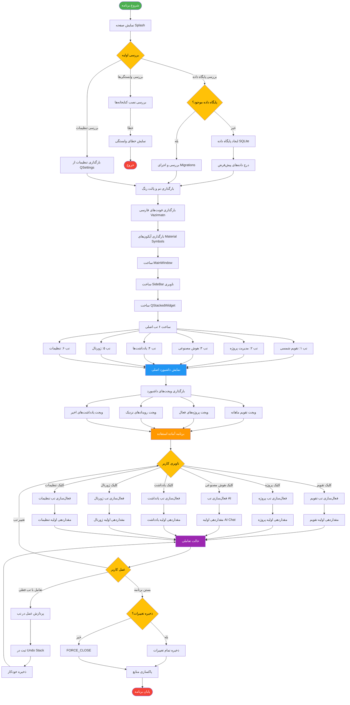

# فلوچارت اصلی برنامه RASK!

## توضیحات
این فلوچارت جریان کلی اجرای برنامه RASK! را از لحظه اجرا تا نمایش داشبورد اصلی و ناوبری بین تب‌های مختلف نشان می‌دهد. برنامه یک اپلیکیشن دسکتاپ مبتنی بر PySide6 است که شامل ۶ بخش اصلی می‌باشد.

## توضیح مراحل اصلی

1. **مرحله راه‌اندازی (Startup)**: برنامه با صفحه Splash شروع شده و وابستگی‌ها، تنظیمات و پایگاه داده را بررسی می‌کند.
2. **مرحله مقداردهی (Initialization)**: تم، فونت فارسی و آیکون‌ها بارگذاری می‌شوند و پنجره اصلی ساخته می‌شود.
3. **مرحله داشبورد (Dashboard)**: ویجت‌های خلاصه اطلاعات نمایش داده می‌شوند.
4. **مرحله تعاملی (Interactive)**: کاربر بین تب‌ها ناوبری می‌کند و هر عمل در Undo Stack ثبت می‌شود.
5. **مرحله بستن (Shutdown)**: تغییرات ذخیره و منابع آزاد می‌شوند.
