# فلوچارت الگوریتم CPM - مسیر بحرانی RASK!

## توضیحات
این فلوچارت الگوریتم مسیر بحرانی (Critical Path Method - CPM) را به‌صورت گام‌به‌گام نشان می‌دهد. شامل حرکت پیش‌رو (Forward Pass)، حرکت پس‌رو (Backward Pass)، محاسبه شناوری (Slack) و شناسایی مسیر بحرانی می‌باشد.

```mermaid
flowchart TD
    START([شروع الگوریتم CPM]) --> INPUT[دریافت داده‌های ورودی]

    INPUT --> TASK_LIST[لیست وظایف با مدت زمان]
    INPUT --> DEP_LIST[لیست وابستگی‌ها]

    TASK_LIST --> VALIDATE{اعتبارسنجی داده‌ها}
    DEP_LIST --> VALIDATE

    VALIDATE -->|داده نامعتبر| VALID_ERR[خطا: داده‌های ورودی ناقص]
    VALID_ERR --> END_ERR([پایان با خطا])

    VALIDATE -->|داده معتبر| BUILD_GRAPH[ساخت گراف جهت‌دار]

    BUILD_GRAPH --> ADD_NODES[افزودن گره‌ها - هر وظیفه یک گره]
    ADD_NODES --> ADD_EDGES[افزودن یال‌ها - هر وابستگی یک یال]
    ADD_EDGES --> TOPO_SORT[مرتب‌سازی توپولوژیک]

    TOPO_SORT --> CYCLE_CHECK{چرخه در گراف؟}
    CYCLE_CHECK -->|بله| CYCLE_ERR[خطا: وابستگی چرخه‌ای شناسایی شد]
    CYCLE_ERR --> END_ERR

    CYCLE_CHECK -->|خیر| SORTED_LIST[لیست مرتب‌شده توپولوژیک]
    SORTED_LIST --> PHASE1

    %% ===== FORWARD PASS =====
    PHASE1[ faz ۱: حرکت پیش‌رو - Forward Pass] --> INIT_FWD[مقداردهی اولیه]
    INIT_FWD --> SET_ES0[ES اولین وظایف = ۰]
    SET_ES0 --> FWD_LOOP[شروع حلقه پیش‌رو]

    FWD_LOOP --> NEXT_TASK_FWD[انتخاب وظیفه بعدی از لیست مرتب]
    NEXT_TASK_FWD --> HAS_PREDECESSOR{پیش‌نیاز دارد؟}

    HAS_PREDECESSOR -->|خیر| ES_ZERO[ESᵢ = ۰]
    HAS_PREDECESSOR -->|بله| CALC_ES

    CALC_ES[محاسبه ESᵢ] --> MAX_EF[ESᵢ = max EFⱼ برای تمام پیش‌نیازهای j]
    MAX_EF --> ES_SET

    ES_ZERO --> ES_SET[ESᵢ تنظیم شد]
    ES_SET --> CALC_EF[محاسبه EFᵢ = ESᵢ + Durationᵢ]

    CALC_EF --> EF_SET[EFᵢ تنظیم شد]
    EF_SET --> MORE_FWD{وظیفه بعدی موجود؟}

    MORE_FWD -->|بله| FWD_LOOP
    MORE_FWD -->|خیر| PROJECT_DUR[مدت پروژه = max EF]

    PROJECT_DUR --> PHASE2

    %% ===== BACKWARD PASS =====
    PHASE2[فاز ۲: حرکت پس‌رو - Backward Pass] --> INIT_BWD[مقداردهی اولیه]
    INIT_BWD --> SET_LF[LF آخرین وظایف = مدت پروژه]
    SET_LF --> BWD_LOOP[شروع حلقه پس‌رو - معکوس]

    BWD_LOOP --> NEXT_TASK_BWD[انتخاب وظیفه بعدی - ترتیب معکوس]
    NEXT_TASK_BWD --> HAS_SUCCESSOR{جانشین دارد؟}

    HAS_SUCCESSOR -->|خیر| LF_PROJECT[LFᵢ = مدت پروژه]
    HAS_SUCCESSOR -->|بله| CALC_LF

    CALC_LF[محاسبه LFᵢ] --> MIN_LS[LFᵢ = min LSⱼ برای تمام جانشین‌های j]
    MIN_LS --> LF_SET

    LF_PROJECT --> LF_SET[LFᵢ تنظیم شد]
    LF_SET --> CALC_LS[محاسبه LSᵢ = LFᵢ - Durationᵢ]

    CALC_LS --> LS_SET[LSᵢ تنظیم شد]
    LS_SET --> MORE_BWD{وظیفه بعدی موجود؟}

    MORE_BWD -->|بله| BWD_LOOP
    MORE_BWD -->|خیر| PHASE3

    %% ===== SLACK CALCULATION =====
    PHASE3[فاز ۳: محاسبه شناوری - Slack] --> SLACK_INIT[مقداردهی اولیه]
    SLACK_INIT --> SLACK_LOOP[شروع حلقه محاسبه]

    SLACK_LOOP --> NEXT_TASK_SLACK[انتخاب وظیفه بعدی]
    NEXT_TASK_SLACK --> CALC_SLACK[Slackᵢ = LSᵢ - ESᵢ]
    CALC_SLACK --> SLACK_SET[Slackᵢ تنظیم شد]

    SLACK_SET --> IS_CRITICAL{Slackᵢ = ۰؟}
    IS_CRITICAL -->|بله| MARK_CRITICAL[علامت‌گذاری بحرانی ⚠️]
    IS_CRITICAL -->|خیر| MARK_FLOAT[علامت‌گذاری غیربحرانی - شناوری: Slackᵢ]

    MARK_CRITICAL --> MORE_SLACK{وظیفه بعدی موجود؟}
    MARK_FLOAT --> MORE_SLACK

    MORE_SLACK -->|بله| SLACK_LOOP
    MORE_SLACK -->|خیر| PHASE4

    %% ===== CRITICAL PATH =====
    PHASE4[فاز ۴: شناسایی مسیر بحرانی] --> TRACE_START[شروع از وظیفه آغازین]
    TRACE_START --> TRACE_LOOP[حلقه ردیابی مسیر]

    TRACE_LOOP --> FIND_CRITICAL[یافتن وظیفه بحرانی بعدی]
    FIND_CRITICAL --> CRITICAL_DEP{وابستگی بحرانی موجود؟}
    CRITICAL_DEP -->|بله| CHECK_FREE_SLACK{Free Slack = ۰؟}

    CHECK_FREE_SLACK -->|بله| ADD_TO_PATH[افزودن به مسیر بحرانی]
    CHECK_FREE_SLACK -->|خیر| BRANCH_CHECK{مسیر جایگزین؟}

    CRITICAL_DEP -->|خیر| PATH_END
    BRANCH_CHECK -->|بله| FIND_CRITICAL
    BRANCH_CHECK -->|خیر| PATH_END

    ADD_TO_PATH --> TRACE_LOOP
    PATH_END[پایان مسیر بحرانی] --> PHASE5

    %% ===== OUTPUT =====
    PHASE5[فاز ۵: تولید خروجی] --> OUT_CRITICAL[لیست مسیر بحرانی]
    PHASE5 --> OUT_DUR[مدت پروژه]
    PHASE5 --> OUT_SLACK[جدول شناوری‌ها]
    PHASE5 --> OUT_STATS[آمار پروژه]

    OUT_CRITICAL --> RENDER[رندر نتایج]
    OUT_DUR --> RENDER
    OUT_SLACK --> RENDER
    OUT_STATS --> RENDER

    RENDER --> GANTT[نمودار گانت با مسیر بحرانی]
    RENDER --> NETWORK[نمودار شبکه‌ای]
    RENDER --> TABLE[جدول ES, EF, LS, LF, Slack]

    GANTT --> END([پایان الگوریتم])
    NETWORK --> END
    TABLE --> END

    style START fill:#4CAF50,color:#fff
    style END fill:#4CAF50,color:#fff
    style END_ERR fill:#f44336,color:#fff
    style PHASE1 fill:#2196F3,color:#fff
    style PHASE2 fill:#FF9800,color:#fff
    style PHASE3 fill:#9C27B0,color:#fff
    style PHASE4 fill:#f44336,color:#fff
    style PHASE5 fill:#607D8B,color:#fff
    style PROJECT_DUR fill:#E91E63,color:#fff
    style MARK_CRITICAL fill:#f44336,color:#fff
    style MARK_FLOAT fill:#4CAF50,color:#fff
    style CYCLE_CHECK fill:#FFC107,color:#000
    style VALIDATE fill:#FFC107,color:#000
    style HAS_PREDECESSOR fill:#FFC107,color:#000
    style MORE_FWD fill:#FFC107,color:#000
    style HAS_SUCCESSOR fill:#FFC107,color:#000
    style MORE_BWD fill:#FFC107,color:#000
    style IS_CRITICAL fill:#FFC107,color:#000
    style MORE_SLACK fill:#FFC107,color:#000
    style CRITICAL_DEP fill:#FFC107,color:#000
    style CHECK_FREE_SLACK fill:#FFC107,color:#000
    style BRANCH_CHECK fill:#FFC107,color:#000
```

## فرمول‌های کلیدی الگوریتم

| فرمول | توضیح |
|---|---|
| **ESᵢ = max(EFⱼ)** برای تمام پیش‌نیازهای j | اولین زمان شروع ممکن |
| **EFᵢ = ESᵢ + Dᵢ** | اولین زمان پایان ممکن |
| **LFᵢ = min(LSⱼ)** برای تمام جانشین‌های j | آخرین زمان پایان مجاز |
| **LSᵢ = LFᵢ - Dᵢ** | آخرین زمان شروع مجاز |
| **Total Slackᵢ = LSᵢ - ESᵢ** | شناوری کل |
| **Free Slackᵢ = min(ESⱼ) - EFᵢ** | شناوری آزاد |
| **مسیر بحرانی** = وظایف با Slack = 0 | مسیری بدون شناوری |

## توضیح فازها

1. **فاز ۱ - حرکت پیش‌رو**: از ابتدا به انتها، ES و EF هر وظیفه محاسبه می‌شود.
2. **فاز ۲ - حرکت پس‌رو**: از انتها به ابتدا، LF و LS هر وظیفه محاسبه می‌شود.
3. **فاز ۳ - محاسبه شناوری**: تفاوت LS و ES نشان‌دهنده انعطاف‌پذیری هر وظیفه است.
4. **فاز ۴ - شناسایی مسیر بحرانی**: ردیابی زنجیره وظایف بحرانی از ابتدا تا انتها.
5. **فاز ۵ - تولید خروجی**: نتایج در نمودار گانت، شبکه‌ای و جدول نمایش داده می‌شوند.
