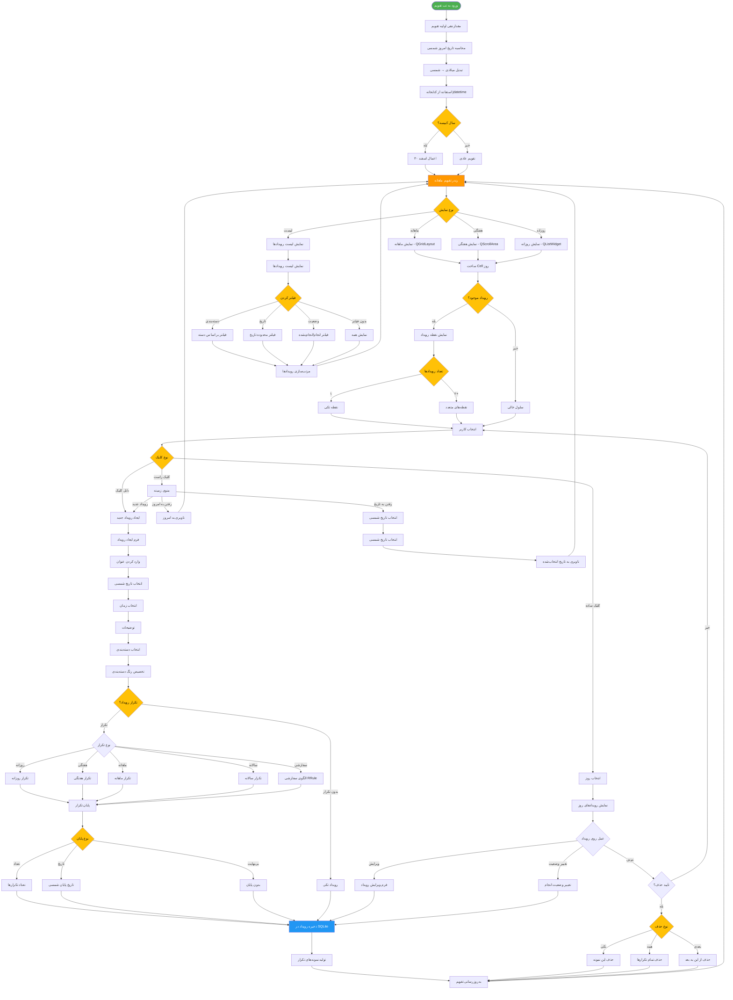

# فلوچارت تقویم شمسی RASK!

## توضیحات
این فلوچارت عملکرد بخش تقویم شمسی برنامه RASK! را نشان می‌دهد. شامل تبدیل تاریخ میلادی به شمسی، ایجاد رویدادها، تنظیم تکرار، و نمایش‌های مختلف تقویم می‌باشد.

## توضیح اجزای اصلی

1. **تبدیل تاریخ شمسی**: با استفاده از کتابخانه `jdatetime` تاریخ میلادی به شمسی تبدیل می‌شود و سال کبیسه بررسی می‌گردد.
2. **نمایش‌های مختلف**: تقویم قابلیت نمایش ماهانه، هفتگی، روزانه و لیستی را دارد.
3. **مدیریت رویدادها**: ایجاد، ویرایش، حذف و تغییر وضعیت رویدادها پشتیبانی می‌شود.
4. **تکرار رویدادها**: پشتیبانی از تکرار روزانه، هفتگی، ماهانه، سالانه و الگوی سفارشی RRule.
5. **فیلتر و مرتب‌سازی**: رویدادها قابل فیلتر بر اساس دسته‌بندی، تاریخ و وضعیت می‌باشند.
