# فلوچارت سفر مشتری RASK!

## توضیحات
این فلوچارت سفر کاربر (Customer Journey) در برنامه RASK! را از لحظه نصب تا استفاده روزانه نشان می‌دهد. شامل نقاط تماس (Touchpoints)، احساسات کاربر و فرصت‌های بهبود در هر مرحله می‌باشد.

```mermaid
flowchart TD
    START([نصب برنامه RASK!]) --> DISCOVER[کشف برنامه]
    DISCOVER --> DISCOVER_CH[📱 کانال: سایت/سوشال مدیا/دوستان]
    DISCOVER_CH --> FIRST_IMP[اولین تأثیر]

    FIRST_IMP[اولین تأثیر] --> LAUNCH[اجرای برنامه]
    LAUNCH --> SPLASH_SEE[مشاهده صفحه Splash]
    SPLASH_SEE --> SPLASH_FEEL[😊 احساس: کنجکاوی و هیجان]

    SPLASH_FEEL --> ONBOARDING{صفحه خوش‌آمدگویی؟}
    ONBOARDING -->|اولین بار| WELCOME[نمایش صفحه خوش‌آمدگویی]
    ONBOARDING -->|بار بعد| DASHBOARD_DIRECT

    WELCOME --> WELCOME_TOUR[تور معرفی - ۳ مرحله‌ای]
    WELCOME_TOUR --> TOUR1[مرحله ۱: آشنایی با تقویم شمسی]
    TOUR1 --> TOUR2[مرحله ۲: آشنایی با مدیریت پروژه]
    TOUR2 --> TOUR3[مرحله ۳: آشنایی با هوش مصنوعی]
    TOUR3 --> TOUR_FEEL[😊 احساس: راهنمایی و هدایت]

    TOUR_FEEL --> DASHBOARD_DIRECT[داشبورد اصلی]
    DASHBOARD_DIRECT --> DASH_SEE[مشاهده داشبورد]
    DASH_SEE --> DASH_FEEL[😊 احساس: نظم و زیبایی]

    %% ===== DASHBOARD EXPLORATION =====
    DASH_FEEL --> DASH_EXPLORE[کاوش داشبورد]
    DASH_EXPLORE --> DASH_WIDGETS[مشاهده ویجت‌ها]

    DASH_WIDGETS --> CAL_WIDGET[ویجت تقویم ماهانه]
    DASH_WIDGETS --> PROJ_WIDGET[ویجت پروژه‌های فعال]
    DASH_WIDGETS --> EVENT_WIDGET[ویجت رویدادهای نزدیک]
    DASH_WIDGETS --> NOTE_WIDGET[ویجت یادداشت‌ها]

    CAL_WIDGET --> CAL_CLICK[کلیک روی تقویم]
    PROJ_WIDGET --> PROJ_CLICK[کلیک روی پروژه]

    %% ===== CALENDAR JOURNEY =====
    CAL_CLICK --> CAL_TAB[ورود به تب تقویم]
    CAL_TAB --> CAL_VIEW[مشاهده تقویم شمسی]
    CAL_VIEW --> CAL_FEEL[😊 احساس: آشنایی - تقویم فارسی!]

    CAL_FEEL --> FIRST_EVENT[اولین رویداد]
    FIRST_EVENT --> CLICK_DATE[کلیک روی تاریخ]
    CLICK_DATE --> EVENT_FORM[فرم ایجاد رویداد]
    EVENT_FORM --> FILL_TITLE[وارد کردن عنوان]
    FILL_TITLE --> SET_TIME[تنظیم زمان]
    SET_TIME --> SAVE_EVENT[ذخیره رویداد]

    SAVE_EVENT --> EVENT_SUCCESS{ذخیره موفق؟}
    EVENT_SUCCESS -->|بله| EVENT_HAPPY[😊 احساس: موفقیت و دستاورد]
    EVENT_SUCCESS -->|خیر| EVENT_FRUST[😤 احساس: ناامیدی]

    EVENT_FRUST --> RETRY_EVENT[تلاش مجدد]
    RETRY_EVENT --> EVENT_FORM
    EVENT_HAPPY --> MORE_EVENTS{رویداد دیگر؟}

    MORE_EVENTS -->|بله| CLICK_DATE
    MORE_EVENTS -->|خیر| EXPLORE_REC[کشف تکرار رویداد]

    EXPLORE_REC --> REC_SETTING[تنظیم تکرار هفتگی]
    REC_SETTING --> REC_SEE[مشاهده رویدادهای تکراری]
    REC_SEE --> REC_FEEL[😊 احساس: کشف قابلیت جدید]

    %% ===== PROJECT JOURNEY =====
    PROJ_CLICK --> PROJ_TAB[ورود به تب پروژه]
    PROJ_TAB --> PROJ_EMPTY{پروژه‌ای موجود؟}

    PROJ_EMPTY -->|خیر| FIRST_PROJECT[ایجاد اولین پروژه]
    PROJ_EMPTY -->|بله| SELECT_PROJ[انتخاب پروژه]

    FIRST_PROJECT --> PROJ_NAME[نام‌گذاری پروژه]
    PROJ_NAME --> PROJ_START_DATE[تاریخ شروع شمسی]
    PROJ_START_DATE --> SAVE_PROJ[ذخیره پروژه]
    SAVE_PROJ --> PROJ_CREATED[😊 احساس: شروع ماجراجویی]

    PROJ_CREATED --> ADD_TASKS[افزودن وظایف]
    ADD_TASKS --> TASK_NAME[نام وظیفه]
    TASK_NAME --> TASK_DURATION[مدت زمان]
    TASK_DURATION --> SAVE_TASK[ذخیره وظیفه]
    SAVE_TASK --> MORE_TASKS{وظیفه دیگر؟}

    MORE_TASKS -->|بله| TASK_NAME
    MORE_TASKS -->|خیر| ADD_DEPS[افزودن وابستگی‌ها]

    ADD_DEPS --> SELECT_PREDECESSOR[انتخاب پیش‌نیاز]
    SELECT_PREDECESSOR --> SELECT_SUCCESSOR[انتخاب جانشین]
    SELECT_SUCCESSOR --> SAVE_DEP[ذخیره وابستگی]
    SAVE_DEP --> MORE_DEPS{وابستگی دیگر؟}

    MORE_DEPS -->|بله| SELECT_PREDECESSOR
    MORE_DEPS -->|خیر| RUN_CPM[محاسبه CPM]

    RUN_CPM --> SEE_CRITICAL[مشاهده مسیر بحرانی]
    SEE_CRITICAL --> CPM_FEEL[😮 احساس: کشف بینش جدید]

    CPM_FEEL --> SEE_GANTT[مشاهده نمودار گانت]
    SEE_GANTT --> GANTT_FEEL[😊 احساس: درک بصری پروژه]

    GANTT_FEEL --> TRY_MC[امتحان شبیه‌سازی مونت‌کارلو]
    TRY_MC --> SET_ESTIMATES[وارد کردن تخمین‌ها]
    SET_ESTIMATES --> RUN_SIM[اجرای شبیه‌سازی]
    RUN_SIM --> SEE_HISTOGRAM[مشاهده هیستوگرام]
    SEE_HISTOGRAM --> MC_FEEL[😮 احساس: تحلیل حرفه‌ای]

    %% ===== AI JOURNEY =====
    MC_FEEL --> AI_CURIOSITY[کنجکاوی درباره AI]
    AI_CURIOSITY --> AI_TAB[ورود به تب AI]
    AI_TAB --> AI_WELCOME[مشاهده چت AI]
    AI_WELCOME --> FIRST_PROMPT[اولین سؤال]

    FIRST_PROMPT --> TYPE_QUESTION[تایپ سؤال]
    TYPE_QUESTION --> SEND_MSG[ارسال پیام]
    SEND_MSG --> WAIT_RESP[انتظار پاسخ]

    WAIT_RESP --> STREAM_START[شروع نمایش Streaming]
    STREAM_START --> SEE_TYPING[مشاهده تایپ تدریجی]
    SEE_TYPING --> AI_FEEL[😊 احساس: تعامل طبیعی]

    AI_FEEL --> FULL_RESPONSE[پاسخ کامل]
    FULL_RESPONSE --> RESPONSE_QUALITY{کیفیت پاسخ؟}

    RESPONSE_QUALITY -->|عالی| AI_HAPPY[😊 احساس: راهنمای هوشمند]
    RESPONSE_QUALITY -->|متوسط| AI_FOLLOWUP[سؤال تکمیلی]
    RESPONSE_QUALITY -->|ضعیف| AI_RETRY[بازفرمول‌بندی سؤال]

    AI_HAPPY --> AI_PROJECT_CMD[استفاده از فرمان‌های پروژه]
    AI_FOLLOWUP --> TYPE_QUESTION
    AI_RETRY --> TYPE_QUESTION

    AI_PROJECT_CMD --> CMD_RESULT[مشاهده نتیجه فرمان]
    CMD_RESULT --> AI_POWER[😊 احساس: قدرت هوش مصنوعی]

    %% ===== JOURNAL JOURNEY =====
    AI_POWER --> JOURNAL_TAB[ورود به تب ژورنال]
    JOURNAL_TAB --> JOURNAL_SEE[مشاهده ژورنال]
    JOURNAL_SEE --> FIRST_ENTRY[اولین نوشته]

    FIRST_ENTRY --> WRITE_ENTRY[نوشتن در ژورنال]
    WRITE_ENTRY --> SAVE_ENTRY[ذخیره نوشته]
    SAVE_ENTRY --> JOURNAL_FEEL[😊 احساس: بیان خود]

    %% ===== DAILY USAGE =====
    JOURNAL_FEEL --> DAILY_USE[استفاده روزانه]
    DAILY_USE --> DAILY_CHECK[بررسی روزانه]

    DAILY_CHECK --> CHECK_CALENDAR[بررسی تقویم و رویدادها]
    DAILY_CHECK --> CHECK_PROJECTS[بررسی وضعیت پروژه‌ها]
    DAILY_CHECK --> CHECK_TASKS[به‌روزرسانی وظایف]
    DAILY_CHECK --> CHECK_JOURNAL[نوشتن ژورنال]

    CHECK_CALENDAR --> UPDATE_STATUS[به‌روزرسانی وضعیت]
    CHECK_PROJECTS --> UPDATE_STATUS
    CHECK_TASKS --> UPDATE_STATUS
    CHECK_JOURNAL --> UPDATE_STATUS

    UPDATE_STATUS --> PROGRESS_SEE[مشاهده پیشرفت]
    PROGRESS_SEE --> PROGRESS_FEEL[😊 احساس: پیشرفت و موفقیت]

    PROGRESS_FEEL --> CONTINUE{ادامه استفاده؟}
    CONTINUE -->|بله| DAILY_USE
    CONTINUE -->|خیر| CLOSE_APP[بستن برنامه]

    CLOSE_APP --> DATA_SAVED[اطمینان از ذخیره داده‌ها]
    DATA_SAVED --> SATISFACTION{رضایت کلی}

    SATISFACTION -->|بالا| RECOMMEND[推荐 به دیگران]
    SATISFACTION -->|متوسط| CONTINUE_USE[ادامه استفاده]
    SATISFACTION -->|پایین| FEEDBACK[ارسال بازخورد]

    RECOMMEND --> END([پایان سفر - کاربر وفادار ✨])
    CONTINUE_USE --> DAILY_USE
    FEEDBACK --> IMPROVE[بهبود برنامه]
    IMPROVE --> END

    style START fill:#4CAF50,color:#fff
    style END fill:#9C27B0,color:#fff
    style SPLASH_FEEL fill:#81C784,color:#fff
    style TOUR_FEEL fill:#81C784,color:#fff
    style DASH_FEEL fill:#81C784,color:#fff
    style CAL_FEEL fill:#81C784,color:#fff
    style EVENT_HAPPY fill:#81C784,color:#fff
    style EVENT_FRUST fill:#E57373,color:#fff
    style REC_FEEL fill:#81C784,color:#fff
    style PROJ_CREATED fill:#81C784,color:#fff
    style CPM_FEEL fill:#64B5F6,color:#fff
    style GANTT_FEEL fill:#81C784,color:#fff
    style MC_FEEL fill:#64B5F6,color:#fff
    style AI_FEEL fill:#81C784,color:#fff
    style AI_HAPPY fill:#81C784,color:#fff
    style AI_POWER fill:#81C784,color:#fff
    style JOURNAL_FEEL fill:#81C784,color:#fff
    style PROGRESS_FEEL fill:#81C784,color:#fff
    style ONBOARDING fill:#FFC107,color:#000
    style EVENT_SUCCESS fill:#FFC107,color:#000
    style MORE_EVENTS fill:#FFC107,color:#000
    style PROJ_EMPTY fill:#FFC107,color:#000
    style MORE_TASKS fill:#FFC107,color:#000
    style MORE_DEPS fill:#FFC107,color:#000
    style RESPONSE_QUALITY fill:#FFC107,color:#000
    style CONTINUE fill:#FFC107,color:#000
    style SATISFACTION fill:#FFC107,color:#000
```

## نقاط تماس کلیدی (Touchpoints)

| مرحله | نقطه تماس | احساس کاربر | فرصت بهبود |
|---|---|---|---|
| **نصب** | صفحه Splash | کنجکاوی | سرعت بارگذاری |
| **اولین ورود** | تور معرفی | هدایت | سادگی پیام‌ها |
| **داشبورد** | ویجت‌ها | نظم | شخصی‌سازی |
| **تقویم** | اولین رویداد | دستاورد | میانبرهای سریع |
| **پروژه** | اولین CPM | کشف | آموزش تعاملی |
| **گانت** | نمودار بصری | درک | Drag & Drop |
| **مونت‌کارلو** | هیستوگرام | حرفه‌ای | توضیح نتایج |
| **AI** | اولین پاسخ | تعامل | کیفیت پاسخ |
| **ژورنال** | نوشتن | بیان | قالب‌های آماده |
| **روزانه** | پیشرفت | موفقیت | اعلان‌ها و یادآوری |

## مراحل سفر مشتری

1. **کشف و نصب**: کاربر با برنامه آشنا شده و آن را نصب می‌کند.
2. **اولین تجربه**: تور معرفی و داشبورد، اولین تأثیر را شکل می‌دهند.
3. **فعال‌سازی**: ایجاد اولین رویداد و پروژه، کاربر را درگیر می‌کند.
4. **کشف عمیق**: CPM، گانت، مونت‌کارلو و AI، ارزش برنامه را نشان می‌دهند.
5. **عادت روزانه**: بررسی روزانه و ژورنال، استفاده مستمر را تضمین می‌کند.
6. **وفاداری**: رضایت منجر به توصیه به دیگران می‌شود.
