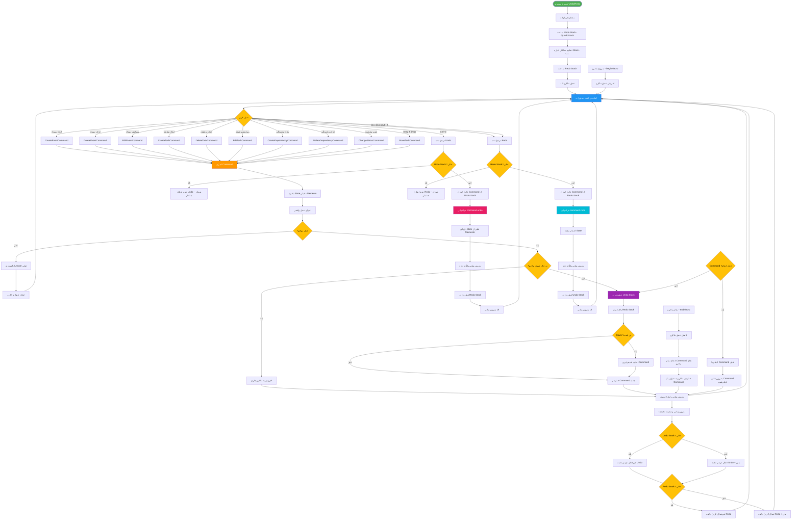

# فلوچارت سیستم Undo/Redo - RASK!

## توضیحات
این فلوچارت سیستم Undo/Redo برنامه RASK! را بر اساس الگوی Command نشان می‌دهد. هر عمل کاربر به یک Command تبدیل شده، در Stack ذخیره می‌شود و قابلیت بازگشت و تکرار دارد.



## ساختار Command الگو

```python
class BaseCommand(QUndoCommand):
    def __init__(self, description):
        super().__init__(description)
        self.memento = None  # State قبلی

    def redo(self):
        """اجرای عمل - اولین بار و هنگام Redo"""
        pass

    def undo(self):
        """بازگشت عمل - هنگام Undo"""
        pass

    def save_state(self):
        """ذخیره State فعلی قبل از تغییر"""
        pass

    def restore_state(self):
        """بازیابی State ذخیره‌شده"""
        pass
```

## انواع Command ها

| Command | عمل redo | عمل undo |
|---|---|---|
| **CreateEventCommand** | ایجاد رویداد | حذف رویداد |
| **DeleteEventCommand** | حذف رویداد | بازیابی رویداد |
| **EditEventCommand** | اعمال تغییرات | بازگشت تغییرات |
| **CreateTaskCommand** | ایجاد وظیفه | حذف وظیفه |
| **DeleteTaskCommand** | حذف وظیفه | بازیابی وظیفه |
| **CreateDependencyCommand** | ایجاد وابستگی | حذف وابستگی |
| **ChangeStatusCommand** | تغییر وضعیت | بازگشت وضعیت |
| **MoveTaskCommand** | جابجایی وظیفه | بازگشت به مکان قبلی |

## توضیح اجزای اصلی

1. **الگوی Command**: هر عمل کاربر به یک شیء Command تبدیل می‌شود.
2. **الگوی Memento**: State قبل از هر عمل ذخیره می‌شود تا قابل بازگشت باشد.
3. **Macro Command**: چند عمل می‌توانند در یک ماکرو ادغام شوند و به‌صورت یک Undo برگردند.
4. **Command Merge**: عملیات مشابه متوالی (مثل تایپ مداوم) ادغام می‌شوند.
5. **پاکسازی Redo Stack**: هر عمل جدید، Redo Stack را پاک می‌کند.
