# فلوچارت مدیریت پروژه RASK!

## توضیحات
این فلوچارت فرآیند مدیریت پروژه در برنامه RASK! را از ایجاد پروژه تا محاسبه مسیر بحرانی (CPM) و نمایش نمودار گانت نشان می‌دهد. شامل ایجاد وظایف، تعریف وابستگی‌ها، و تحلیل شبکه پروژه می‌باشد.

```mermaid
flowchart TD
    START([ورود به تب پروژه]) --> PROJ_VIEW{نمای پروژه}

    PROJ_VIEW -->|لیست پروژه‌ها| PROJ_LIST[نمایش لیست پروژه‌ها]
    PROJ_VIEW -->|پروژه فعال| ACTIVE_PROJ[نمایش پروژه فعلی]

    PROJ_LIST --> PROJ_ACTION{عمل پروژه}
    PROJ_ACTION -->|پروژه جدید| NEW_PROJ[ایجاد پروژه جدید]
    PROJ_ACTION -->|باز کردن| OPEN_PROJ[باز کردن پروژه]
    PROJ_ACTION -->|حذف| DEL_PROJ{تأیید حذف؟}

    DEL_PROJ -->|بله| DEL_PROJ_DB[حذف از پایگاه داده]
    DEL_PROJ -->|خیر| PROJ_LIST
    DEL_PROJ_DB --> PROJ_LIST

    NEW_PROJ --> PROJ_FORM[فرم ایجاد پروژه]
    PROJ_FORM --> PROJ_NAME[نام پروژه]
    PROJ_NAME --> PROJ_DESC[توضیحات]
    PROJ_DESC --> PROJ_START[تاریخ شروع شمسی]
    PROJ_START --> PROJ_PRIORITY[اولویت: بالا/متوسط/پایین]
    PROJ_PRIORITY --> PROJ_COLOR[رنگ پروژه]
    PROJ_COLOR --> SAVE_PROJ[ذخیره پروژه در SQLite]

    OPEN_PROJ --> ACTIVE_PROJ
    SAVE_PROJ --> ACTIVE_PROJ

    ACTIVE_PROJ --> PROJ_DASHBOARD[داشبورد پروژه]
    PROJ_DASHBOARD --> PROJ_NAV{ناوبری پروژه}

    PROJ_NAV -->|وظایف| TASK_VIEW[نمای وظایف]
    PROJ_NAV -->|گانت| GANTT_VIEW[نمای گانت]
    PROJ_NAV -->|CPM| CPM_VIEW[نمای مسیر بحرانی]
    PROJ_NAV -->|مونت‌کارلو| MC_VIEW[نمای شبیه‌سازی]
    PROJ_NAV -->|اطلاعات| PROJ_INFO[اطلاعات پروژه]

    TASK_VIEW --> TASK_ACTION{عمل وظیفه}

    TASK_ACTION -->|وظیفه جدید| NEW_TASK[ایجاد وظیفه جدید]
    TASK_ACTION -->|ویرایش| EDIT_TASK[ویرایش وظیفه]
    TASK_ACTION -->|حذف| DEL_TASK[حذف وظیفه]
    TASK_ACTION -->|تغییر وضعیت| STATUS_CHANGE[تغییر وضعیت وظیفه]

    NEW_TASK --> TASK_FORM[فرم ایجاد وظیفه]
    TASK_FORM --> TASK_NAME[نام وظیفه]
    TASK_NAME --> TASK_DUR[مدت زمان - روز]
    TASK_DUR --> TASK_DUR_TYPE{نوع مدت‌زمان}

    TASK_DUR_TYPE -->|قطعی| FIXED_DUR[مدت زمان قطعی]
    TASK_DUR_TYPE -->|تخمینی| EST_DUR[تخمین سه‌نقطه‌ای]

    EST_DUR --> OPTIMISTIC[زمان خوش‌بینانه - a]
    OPTIMISTIC --> MOST_LIKELY[زمان محتمل - m]
    MOST_LIKELY --> PESSIMISTIC[زمان بدبینانه - b]
    PESSIMISTIC --> PERT_CALC[محاسبه PERT: t = a + 4m + b / 6]
    PERT_CALC --> SAVE_DUR

    FIXED_DUR --> SAVE_DUR[ذخیره مدت زمان]

    SAVE_DUR --> TASK_DEPS[تعریف وابستگی‌ها]
    TASK_DEPS --> DEP_TYPE{نوع وابستگی}

    DEP_TYPE -->|پایان به شروع FS| FS_DEP[Finish-to-Start]
    DEP_TYPE -->|شروع به شروع SS| SS_DEP[Start-to-Start]
    DEP_TYPE -->|پایان به پایان FF| FF_DEP[Finish-to-Finish]
    DEP_TYPE -->|شروع به پایان SF| SF_DEP[Start-to-Finish]

    FS_DEP --> DEP_LAG[تأخیر/شتاب - Lag/Lead]
    SS_DEP --> DEP_LAG
    FF_DEP --> DEP_LAG
    SF_DEP --> DEP_LAG

    DEP_LAG --> DEP_SELECT[انتخاب وظیفه پیش‌نیاز]
    DEP_SELECT --> MORE_DEP{وابستگی دیگر؟}
    MORE_DEP -->|بله| DEP_TYPE
    MORE_DEP -->|خیر| TASK_SAVE[ذخیره وظیفه]

    TASK_SAVE --> CHECK_CYCLE{بررسی چرخه؟}
    CHECK_CYCLE -->|چرخه یافت شد| CYCLE_ERR[خطا: وابستگی چرخه‌ای]
    CHECK_CYCLE -->|بدون چرخه| UPDATE_NETWORK

    CYCLE_ERR --> TASK_DEPS
    UPDATE_NETWORK[به‌روزرسانی شبکه پروژه] --> CALC_CPM

    CALC_CPM[محاسبه CPM] --> FWD_PASS[حرکت پیش‌رو - Forward Pass]
    FWD_PASS --> CALC_ES[محاسبه ES - Early Start]
    CALC_ES --> CALC_EF[محاسبه EF = ES + Duration]
    CALC_EF --> FWD_NEXT{وظیفه بعدی؟}
    FWD_NEXT -->|بله| CALC_ES
    FWD_NEXT -->|خیر| PROJECT_DUR[مدت پروژه = max EF]

    PROJECT_DUR --> BWD_PASS[حرکت پس‌رو - Backward Pass]
    BWD_PASS --> CALC_LF[محاسبه LF - Late Finish]
    CALC_LF --> CALC_LS[محاسبه LS = LF - Duration]
    CALC_LS --> BWD_NEXT{وظیفه بعدی؟}
    BWD_NEXT -->|بله| CALC_LF
    BWD_NEXT -->|خیر| SLACK_CALC

    SLACK_CALC[محاسبه شناوری - Slack] --> SLACK_FORM[Slack = LS - ES]
    SLACK_FORM --> CRITICAL_CHECK{Slack = 0؟}
    CRITICAL_CHECK -->|بله| CRITICAL[وظیفه بحرانی ✓]
    CRITICAL_CHECK -->|خیر| NON_CRITICAL[وظیفه غیربحرانی]

    CRITICAL --> ALL_TASKS{تمام وظایف بررسی شد؟}
    NON_CRITICAL --> ALL_TASKS
    ALL_TASKS -->|خیر| SLACK_FORM
    ALL_TASKS -->|بله| CRITICAL_PATH[مسیر بحرانی شناسایی شد]

    CRITICAL_PATH --> UPDATE_VIEWS[به‌روزرسانی همه نماها]

    GANTT_VIEW --> RENDER_GANTT[رندر نمودار گانت]
    RENDER_GANTT --> GANTT_BARS[رسم نوارهای وظایف]
    GANTT_BARS --> GANTT_DEPS[رسم خطوط وابستگی]
    GANTT_DEPS --> GANTT_CRITICAL[برجسته‌سازی مسیر بحرانی]
    GANTT_CRITICAL --> GANTT_MILESTONE[نمایش مایلستون‌ها]
    GANTT_MILESTONE --> GANTT_INTERACT[تعامل: Drag & Drop]

    CPM_VIEW --> RENDER_CPM[رندر نمودار CPM]
    RENDER_CPM --> NETWORK_DIAGRAM[نمودار شبکه‌ای]
    NETWORK_DIAGRAM --> CRITICAL_HIGHLIGHT[برجسته‌سازی مسیر بحرانی]
    CRITICAL_HIGHLIGHT --> UPDATE_VIEWS

    MC_VIEW --> MC_INIT[مقداردهی شبیه‌سازی]
    MC_INIT --> MC_RUN[اجرای شبیه‌سازی مونت‌کارلو]
    MC_RUN --> UPDATE_VIEWS

    EDIT_TASK --> TASK_FORM
    DEL_TASK --> CONFIRM_DEL{تأیید حذف؟}
    CONFIRM_DEL -->|بله| REMOVE_DEPS[حذف وابستگی‌های مرتبط]
    CONFIRM_DEL -->|خیر| TASK_VIEW
    REMOVE_DEPS --> UPDATE_NETWORK

    STATUS_CHANGE --> NEW_STATUS{وضعیت جدید}
    NEW_STATUS -->|انجام‌نشده| SET_TODO[تنظیم: TODO]
    NEW_STATUS -->|درحال انجام| SET_PROGRESS[تنظیم: IN PROGRESS]
    NEW_STATUS -->|انجام‌شده| SET_DONE[تنظیم: DONE]
    SET_TODO --> UPDATE_PROGRESS
    SET_PROGRESS --> UPDATE_PROGRESS
    SET_DONE --> UPDATE_PROGRESS

    UPDATE_PROGRESS[به‌روزرسانی درصد پیشرفت پروژه] --> CALC_CPM

    PROJ_INFO --> PROJ_STATS[آمار پروژه]
    PROJ_STATS --> STAT_TOTAL[تعداد کل وظایف]
    PROJ_STATS --> STAT_DONE[وظایف انجام‌شده]
    PROJ_STATS --> STAT_CRITICAL[تعداد وظایف بحرانی]
    PROJ_STATS --> STAT_DURATION[مدت تخمینی پروژه]

    style START fill:#4CAF50,color:#fff
    style CALC_CPM fill:#2196F3,color:#fff
    style CRITICAL_PATH fill:#f44336,color:#fff
    style SAVE_PROJ fill:#2196F3,color:#fff
    style TASK_SAVE fill:#2196F3,color:#fff
    style CHECK_CYCLE fill:#FFC107,color:#000
    style TASK_DUR_TYPE fill:#FFC107,color:#000
    style DEP_TYPE fill:#FFC107,color:#000
    style CRITICAL_CHECK fill:#FFC107,color:#000
    style PROJ_NAV fill:#FFC107,color:#000
    style TASK_ACTION fill:#FFC107,color:#000
    style MORE_DEP fill:#FFC107,color:#000
```

## توضیح اجزای اصلی

1. **ایجاد پروژه**: تعریف پروژه با نام، توضیحات، تاریخ شروع و اولویت.
2. **ایجاد وظایف**: هر وظیفه با مدت زمان قطعی یا تخمینی (سه‌نقطه‌ای PERT) تعریف می‌شود.
3. **وابستگی‌ها**: چهار نوع وابستگی FS, SS, FF, SF با قابلیت تعریف Lag/Lead.
4. **بررسی چرخه**: قبل از ذخیره وابستگی، بررسی می‌شود که چرخه ایجاد نشود.
5. **محاسبه CPM**: حرکت پیش‌رو و پس‌رو برای محاسبه ES, EF, LS, LF و Slack.
6. **مسیر بحرانی**: وظایفی با Slack = 0 مسیر بحرانی را تشکیل می‌دهند.
7. **نمودار گانت**: نمایش بصری وظایف با نوارهای زمانی و خطوط وابستگی.
