# فلوچارت شبیه‌سازی مونت‌کارلو RASK!

## توضیحات
این فلوچارت فرآیند شبیه‌سازی مونت‌کارلو (Monte Carlo Simulation) برای تحلیل ریسک پروژه را نشان می‌دهد. شامل دریافت تخمین‌های سه‌نقطه‌ای، نمونه‌گیری تصادفی، اجرای تکرارها، ساخت هیستوگرام و محاسبه احتمال تکمیل پروژه می‌باشد.

```mermaid
flowchart TD
    START([شروع شبیه‌سازی مونت‌کارلو]) --> CHECK_DATA{داده‌های پروژه موجود؟}

    CHECK_DATA -->|خیر| NO_DATA[خطا: ابتدا پروژه و وظایف را تعریف کنید]
    NO_DATA --> END_ERR([پایان با خطا])

    CHECK_DATA -->|بله| LOAD_PROJECT[بارگذاری داده‌های پروژه]
    LOAD_PROJECT --> LOAD_TASKS[بارگذاری لیست وظایف]
    LOAD_TASKS --> LOAD_DEPS[بارگذاری وابستگی‌ها]

    LOAD_DEPS --> CHECK_ESTIMATES{تخمین‌های سه‌نقطه‌ای موجود؟}
    CHECK_ESTIMATES -->|خیر| PROMPT_EST[درخواست وارد کردن تخمین‌ها]
    CHECK_ESTIMATES -->|بله| COLLECT_EST

    PROMPT_EST --> EST_FORM[فرم تخمین سه‌نقطه‌ای]
    EST_FORM --> TASK_EST_LOOP[حلقه روی هر وظیفه]

    TASK_EST_LOOP --> NEXT_TASK[انتخاب وظیفه بعدی]
    NEXT_TASK --> INPUT_A[وارد کردن a - خوش‌بینانه]
    INPUT_A --> INPUT_M[وارد کردن m - محتمل‌ترین]
    INPUT_M --> INPUT_B[وارد کردن b - بدبینانه]
    INPUT_B --> VALIDATE_EST{a ≤ m ≤ b؟}

    VALIDATE_EST -->|خیر| EST_ERR[خطا: تخمین‌ها نامعتبر]
    EST_ERR --> INPUT_A
    VALIDATE_EST -->|بله| SAVE_EST[ذخیره تخمین‌ها]
    SAVE_EST --> MORE_TASKS{وظیفه دیگر؟}
    MORE_TASKS -->|بله| NEXT_TASK
    MORE_TASKS -->|خیر| COLLECT_EST

    COLLECT_EST[جمع‌آوری تمام تخمین‌ها] --> CONFIG_SIM[پیکربندی شبیه‌سازی]
    CONFIG_SIM --> SET_ITERATIONS[تنظیم تعداد تکرارها - پیش‌فرض: ۱۰۰۰]
    SET_ITERATIONS --> SET_CONFIDENCE[تنظیم سطح اطمینان - پیش‌فرض: ۹۵٪]
    SET_CONFIDENCE --> SET_DISTRIBUTION{نوع توزیع}

    SET_DISTRIBUTION -->|توزیع مثلثی| TRIANGULAR[توزیع مثلثی - Triangular]
    SET_DISTRIBUTION -->|توزیع بتا| BETA_PERT[توزیع بتا - PERT]
    SET_DISTRIBUTION -->|توزیع نرمال| NORMAL_DIST[توزیع نرمال - Normal]

    TRIANGULAR --> INIT_SIM
    BETA_PERT --> INIT_SIM
    NORMAL_DIST --> INIT_SIM

    INIT_SIM[مقداردهی اولیه شبیه‌سازی] --> INIT_RESULTS[آرایه نتایج خالی]
    INIT_RESULTS --> INIT_COUNTER[شمارنده تکرار = ۰]
    INIT_COUNTER --> SIM_LOOP[شروع حلقه شبیه‌سازی]

    %% ===== MAIN SIMULATION LOOP =====
    SIM_LOOP --> INCR_COUNTER[شمارنده++]
    INCR_COUNTER --> SAMPLE_LOOP[شروع حلقه نمونه‌گیری]

    SAMPLE_LOOP --> NEXT_TASK_SIM[انتخاب وظیفه بعدی]
    NEXT_TASK_SIM --> RANDOM_SAMPLE[تولید عدد تصادفی]

    RANDOM_SAMPLE --> DIST_TYPE{نوع توزیع}

    DIST_TYPE -->|مثلثی| TRI_SAMPLE[نمونه‌گیری مثلثی:\nt = a + sqrt r × b - a × m - a اگر r ≤ m-a/b-a\nt = b - sqrt 1-r × b - a × b - m در غیر این صورت]
    DIST_TYPE -->|بتا PERT| BETA_SAMPLE[نمونه‌گیری بتا:\nμ = a + 4m + b / 6\nσ = b - a / 6\nنمونه از N μ, σ²]
    DIST_TYPE -->|نرمال| NORM_SAMPLE[نمونه‌گیری نرمال:\nμ = a + 4m + b / 6\nσ = b - a / 6\nنمونه از N μ, σ²]

    TRI_SAMPLE --> SET_SIM_DUR[تنظیم مدت شبیه‌سازی‌شده]
    BETA_SAMPLE --> SET_SIM_DUR
    NORM_SAMPLE --> SET_SIM_DUR

    SET_SIM_DUR --> MORE_TASKS_SIM{وظیفه دیگر؟}
    MORE_TASKS_SIM -->|بله| NEXT_TASK_SIM
    MORE_TASKS_SIM -->|خیر| RUN_CPM

    RUN_CPM[اجرای CPM با مدت‌های شبیه‌سازی‌شده] --> CALC_FWD[محاسبه Forward Pass]
    CALC_FWD --> CALC_BWD[محاسبه Backward Pass]
    CALC_BWD --> FIND_CP[یافتن مسیر بحرانی]
    FIND_CP --> PROJECT_DUR_SIM[مدت پروژه این تکرار]

    PROJECT_DUR_SIM --> STORE_RESULT[ذخیره نتیجه در آرایه]
    STORE_RESULT --> MORE_ITERS{تکرار دیگر؟}

    MORE_ITERS -->|بله| SIM_LOOP
    MORE_ITERS -->|خیر| ANALYSIS

    %% ===== ANALYSIS =====
    ANALYSIS[شروع تحلیل نتایج] --> SORT_RESULTS[مرتب‌سازی نتایج]
    SORT_RESULTS --> CALC_STATS[محاسبه آمار توصیفی]

    CALC_STATS --> MEAN[میانگین مدت پروژه μ]
    CALC_STATS --> STD_DEV[انحراف معیار σ]
    CALC_STATS --> MEDIAN[میانه]
    CALC_STATS --> MIN_MAX[حداقل و حداکثر]
    CALC_STATS --> PERCENTILES[صدک‌ها: P10, P25, P50, P75, P90, P95]

    MEAN --> HISTOGRAM
    STD_DEV --> HISTOGRAM
    MEDIAN --> HISTOGRAM
    MIN_MAX --> HISTOGRAM
    PERCENTILES --> HISTOGRAM

    HISTOGRAM[ساخت هیستوگرام] --> BIN_DATA[دسته‌بندی داده‌ها - Binning]
    BIN_DATA --> CALC_FREQ[محاسبه فراوانی هر دسته]
    CALC_FREQ --> DRAW_BARS[رسم نوارهای هیستوگرام]
    DRAW_BARS --> FIT_CURVE[برازش منحنی نرمال]

    FIT_CURVE --> PROB_CALC[محاسبه احتمال‌ها]
    PROB_CALC --> TARGET_DATE{تاریخ هدف مشخص؟}

    TARGET_DATE -->|بله| PROB_ON_TIME[احتمال تکمیل تا تاریخ هدف:\nP = تعداد نتایج ≤ هدف / کل تکرارها]
    TARGET_DATE -->|خیر| PROB_DEFAULT[محاسبه احتمال برای بازه‌های مختلف]

    PROB_ON_TIME --> S_CURVE[ساخت منحنی S - S-Curve]
    PROB_DEFAULT --> S_CURVE

    S_CURVE[رسم منحنی S - تابع توزیع تجمعی] --> RISK_CALC[محاسبه ریسک]

    RISK_CALC --> RISK_LEVEL{سطح ریسک}
    RISK_LEVEL -->|P < ۵۰٪| HIGH_RISK[ریسک بالا - قرمز 🔴]
    RISK_LEVEL -->|۵۰٪ ≤ P < ۸۰٪| MED_RISK[ریسک متوسط - نارنجی 🟠]
    RISK_LEVEL -->|P ≥ ۸۰٪| LOW_RISK[ریسک کم - سبز 🟢]

    HIGH_RISK --> RENDER_RESULTS
    MED_RISK --> RENDER_RESULTS
    LOW_RISK --> RENDER_RESULTS

    RENDER_RESULTS[رندر نتایج] --> SHOW_HIST[نمایش هیستوگرام]
    RENDER_RESULTS --> SHOW_S_CURVE[نمایش منحنی S]
    RENDER_RESULTS --> SHOW_TABLE[نمایش جدول آمار]
    RENDER_RESULTS --> SHOW_RISK[نمایش شاخص ریسک]

    SHOW_HIST --> END([پایان شبیه‌سازی])
    SHOW_S_CURVE --> END
    SHOW_TABLE --> END
    SHOW_RISK --> END

    style START fill:#4CAF50,color:#fff
    style END fill:#4CAF50,color:#fff
    style END_ERR fill:#f44336,color:#fff
    style SIM_LOOP fill:#2196F3,color:#fff
    style ANALYSIS fill:#9C27B0,color:#fff
    style HISTOGRAM fill:#FF9800,color:#fff
    style S_CURVE fill:#E91E63,color:#fff
    style HIGH_RISK fill:#f44336,color:#fff
    style MED_RISK fill:#FF9800,color:#fff
    style LOW_RISK fill:#4CAF50,color:#fff
    style CHECK_DATA fill:#FFC107,color:#000
    style CHECK_ESTIMATES fill:#FFC107,color:#000
    style VALIDATE_EST fill:#FFC107,color:#000
    style MORE_TASKS fill:#FFC107,color:#000
    style SET_DISTRIBUTION fill:#FFC107,color:#000
    style DIST_TYPE fill:#FFC107,color:#000
    style MORE_TASKS_SIM fill:#FFC107,color:#000
    style MORE_ITERS fill:#FFC107,color:#000
    style TARGET_DATE fill:#FFC107,color:#000
    style RISK_LEVEL fill:#FFC107,color:#000
```

## فرمول‌های کلیدی شبیه‌سازی

| فرمول | توضیح |
|---|---|
| **μ = (a + 4m + b) / 6** | میانگین تخمین PERT |
| **σ = (b - a) / 6** | انحراف معیار تخمین PERT |
| **P = Count(X ≤ Target) / N** | احتمال تکمیل تا تاریخ هدف |
| **Triangular(a, m, b)** | توزیع مثلثی با سه پارامتر |
| **S-Curve = CDF(Histogram)** | منحنی تجمعی احتمال |

## توضیح فازها

1. **جمع‌آوری داده‌ها**: تخمین‌های سه‌نقطه‌ای (خوش‌بینانه، محتمل، بدبینانه) برای هر وظیفه.
2. **پیکربندی**: تعداد تکرارها، سطح اطمینان و نوع توزیع احتمال تنظیم می‌شود.
3. **حلقه شبیه‌سازی**: در هر تکرار، مدت هر وظیفه از توزیع نمونه‌گیری شده و CPM اجرا می‌شود.
4. **تحلیل نتایج**: آمار توصیفی، هیستوگرام و منحنی S محاسبه می‌شوند.
5. **ارزیابی ریسک**: احتمال تکمیل پروژه تا تاریخ هدف و سطح ریسک تعیین می‌شود.
