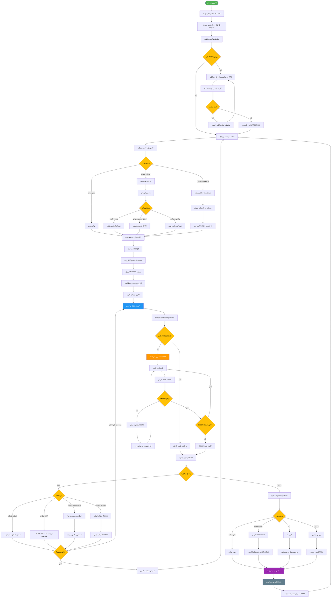

# فلوچارت سرویس هوش مصنوعی RASK!

## توضیحات
این فلوچارت عملکرد سرویس هوش مصنوعی برنامه RASK! را نشان می‌دهد. شامل ارسال درخواست به API مدل GLM، دریافت پاسخ Streaming، پارس کردن پاسخ و نمایش آن در رابط کاربری می‌باشد.

## توضیح اجزای اصلی

1. **مدیریت کلید API**: کلید GLM API در QSettings ذخیره و اعتبارسنجی می‌شود.
2. **ساخت Prompt**: System Prompt، Context پروژه و تاریخچه مکالمه ترکیب می‌شوند.
3. **Streaming**: پاسخ API به صورت SSE (Server-Sent Events) دریافت و به‌صورت زنده نمایش داده می‌شود.
4. **مدیریت خطا**: خطاهای شبکه، API، Rate Limit و Token به‌صورت جداگانه مدیریت می‌شوند.
5. **پارس محتوا**: پاسخ بر اساس نوع (متن، Markdown، کد، جدول) پردازش و رندر می‌شود.
6. **ذخیره‌سازی**: تمام پیام‌ها در SQLite ذخیره و شمارنده Token به‌روز می‌شود.
