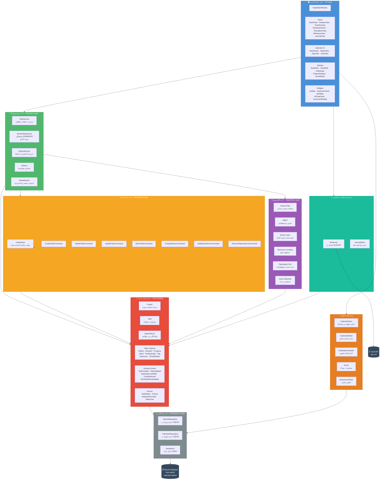
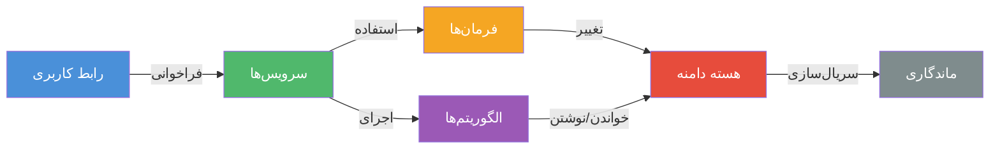
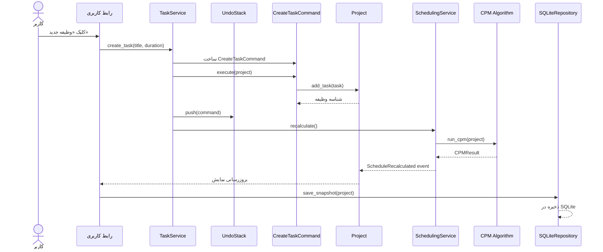

# معماری سیستم RASK! — لایه‌های DDD

## توضیحات

این نمودار معماری لایه‌ای سیستم RASK! را بر اساس الگوی **طراحی راهنمایی‌شده با دامنه (Domain-Driven Design)** نشان می‌دهد. سیستم از ۶ لایه مجزا تشکیل شده که هر لایه فقط به لایه‌های زیرین خود وابسته است. این جداسازی تضمین می‌کند که منطق کسب‌وکار مستقل از زیرساخت فنی بماند و قابلیت آزمون‌پذیری و نگهداری کد افزایش یابد.

### ساختار لایه‌ها

| لایه | مسئولیت | ماژول پایتون |
|------|---------|-------------|
| **رابط کاربری (UI)** | نمایش اطلاعات، تعامل کاربر، ویجت‌های PySide6 | `kharazmi.ui` |
| **سرویس‌ها (Services)** | هماهنگی عملیات، تراکنش‌های اپلیکیشن | `kharazmi.services` |
| **فرمان‌ها (Commands)** | عملیات برگشت‌پذیر (Undo/Redo) | `kharazmi.commands` |
| **الگوریتم‌ها (Algorithms)** | CPM، PERT، مونت‌کارلو، تسطیح منابع | `kharazmi.algorithms` |
| **هسته دامنه (Core Domain)** | موجودیت‌ها، اشیاء ارزشی، رویدادها | `kharazmi.core` |
| **ماندگاری (Persistence)** | ذخیره‌سازی SQLite، سریال‌سازی | `kharazmi.persistence` |

---

## نمودار معماری

---

## قوانین وابستگی

### اصل وابستگی معکوس

- لایه‌های بالاتر به لایه‌های پایین‌تر وابسته‌اند، نه برعکس
- هسته دامنه (Core) هیچ وابستگی به لایه‌های بالاتر ندارد
- الگوریتم‌ها فقط از موجودیت‌های هسته استفاده می‌کنند
- سرویس‌ها هماهنگ‌کننده بین لایه‌ها هستند
- رابط کاربری فقط از طریق سرویس‌ها با دامنه ارتباط دارد

---

## جریان یک عملیات نمونه: ایجاد وظیفه

