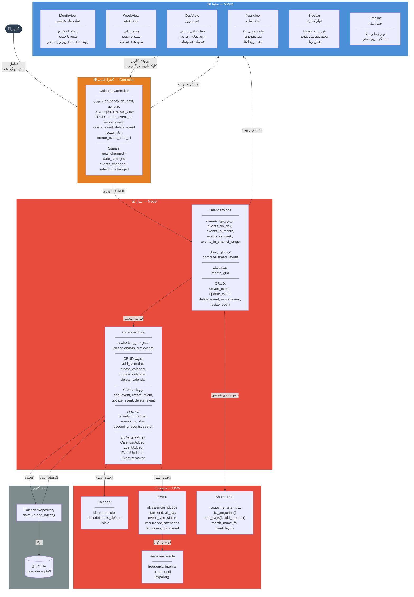
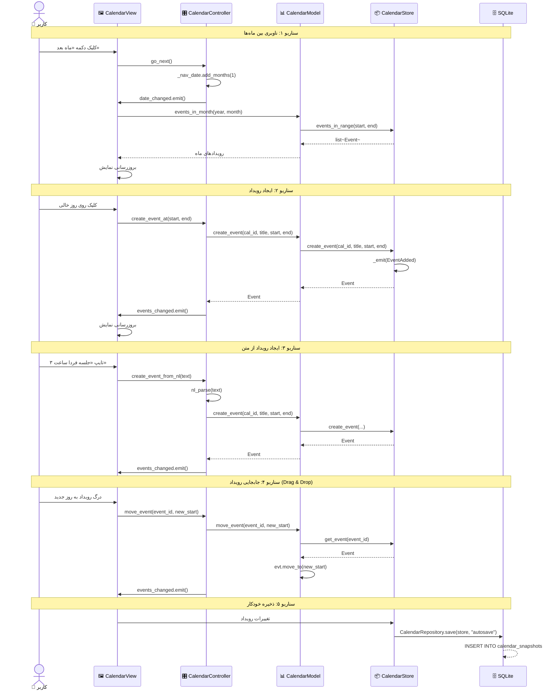
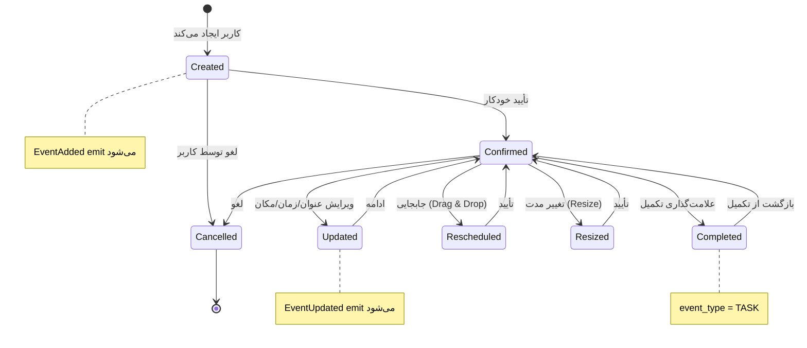

# نمودار الگوی MVC تقویم RASK! — Calendar MVC Pattern

## توضیحات

زیرسیستم تقویم RASK! بر اساس الگوی **Model-View-Controller (MVC)** طراحی شده است. این الگو جداسازی مسئولیت‌ها را تضمین می‌کند:

- **Model (مدل)**: مدیریت داده‌ها و منطق کسب‌وکار — `CalendarStore` و `CalendarModel`
- **View (نما)**: نمایش اطلاعات به کاربر — نماهای ماه، هفته، روز و سال
- **Controller (کنترل‌کننده)**: هماهنگی بین Model و View — `CalendarController`

ویژگی منحصربه‌فرد این پیاده‌سازی، **پشتیبانی کامل از تقویم شمسی (جلالی)** است. تمام محاسبات تاریخ و ناوبری بر اساس گاه‌شماری هجری خورشیدی انجام می‌شود.

---

## نمودار کلی الگوی MVC

---

## نمودار تعاملات MVC

---

## نمودار ساختار داخلی نماها

```mermaid
graph TB
    subgraph CalendarView["CalendarView — نمای اصلی تقویم"]
        direction TB
        Toolbar["Toolbar<br/>دکمه‌های ناوبری<br/>انتخاب نوع نما<br/>دکمه «امروز»"]
        ViewStack["QStackedWidget<br/>تعویض نماها"]
        StatusBar["StatusBar<br/>نمایش تاریخ فعلی<br/>تعداد رویدادها"]
    end

    subgraph MonthViewStruct["MonthView — ساختار داخلی"]
        direction TB
        Header1["Header Row<br/>شنبه · یکشنبه · ... · جمعه"]
        Grid1["6×7 Grid<br/>شبکه روزهای ماه"]
        AllDay1["All-Day Row<br/>رویدادهای تمام‌روز"]
        EventWidgets1["Event Widgets<br/>رویدادهای زمان‌دار"]
    end

    subgraph WeekViewStruct["WeekView — ساختار داخلی"]
        direction TB
        Header2["Header Row<br/>تاریخ هر روز هفته"]
        TimeColumn2["Time Column<br/>ساعت‌های روز"]
        DayColumns2["7 Day Columns<br/>شنبه تا جمعه"]
        EventWidgets2["Event Widgets<br/>رویدادهای زمان‌دار<br/>چیدمان همپوشانی"]
    end

    subgraph DayViewStruct["DayView — ساختار داخلی"]
        direction TB
        Header3["Header<br/>تاریخ و روز هفته"]
        TimeColumn3["Time Column<br/>ساعت‌های ۰۰:۰۰ تا ۲۳:۰۰"]
        AllDay3["All-Day Area<br/>رویدادهای تمام‌روز"]
        DayArea3["Day Area<br/>رویدادهای زمان‌دار"]
        EventWidgets3["Event Widgets<br/>چیدمان دقیق همپوشانی"]
    end

    subgraph YearViewStruct["YearView — ساختار داخلی"]
        direction TB
        Header4["Year Header<br/>تعداد سال"]
        MonthGrids4["12 Mini Calendars<br/>فروردین تا اسفند"]
        EventCounts4["Event Count Badges<br/>تعداد رویداد هر روز"]
    end

    CalendarView --> Toolbar
    CalendarView --> ViewStack
    CalendarView --> StatusBar
    ViewStack --> MonthViewStruct
    ViewStack --> WeekViewStruct
    ViewStack --> DayViewStruct
    ViewStack --> YearViewStruct

    style CalendarView fill:#4A90D9,stroke:#2C5F8A,color:#fff
    style MonthViewStruct fill:#5DADE2,stroke:#2E86C1,color:#fff
    style WeekViewStruct fill:#5DADE2,stroke:#2E86C1,color:#fff
    style DayViewStruct fill:#5DADE2,stroke:#2E86C1,color:#fff
    style YearViewStruct fill:#5DADE2,stroke:#2E86C1,color:#fff
```

---

## نمودار چرخه حیات رویداد تقویم

---

## مقایسه نماها

| ویژگی | MonthView | WeekView | DayView | YearView |
|-------|-----------|----------|---------|----------|
| **دوره زمانی** | یک ماه شمسی | هفته ایرانی (شنبه-جمعه) | یک روز | یک سال |
| **رویدادهای تمام‌روز** | ✅ ردیف بالا | ✅ ردیف بالا | ✅ ناحیه جداگانه | ❌ |
| **رویدادهای زمان‌دار** | ✅ فشرده | ✅ چیدمان دقیق | ✅ چیدمان دقیق | ❌ |
| **تشخیص همپوشانی** | محدود | ✅ کامل | ✅ کامل | ❌ |
| **درگ اند دراپ** | ✅ جابجایی | ✅ جابجایی + تغییر مدت | ✅ جابجایی + تغییر مدت | ❌ |
| **نمایش تعداد رویداد** | ✅ | ❌ | ❌ | ✅ نشانگر |
| **ناوبری** | ماه بعد/قبل | هفته بعد/قبل | روز بعد/قبل | سال بعد/قبل |
