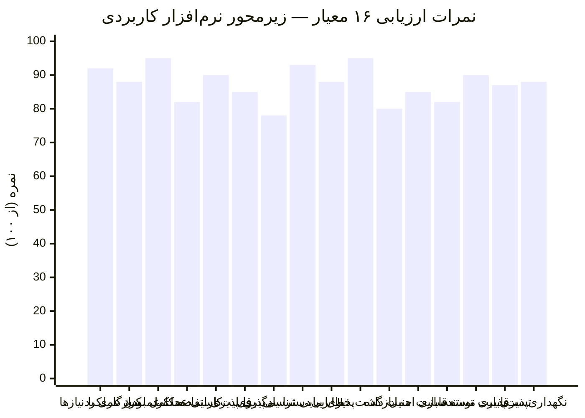
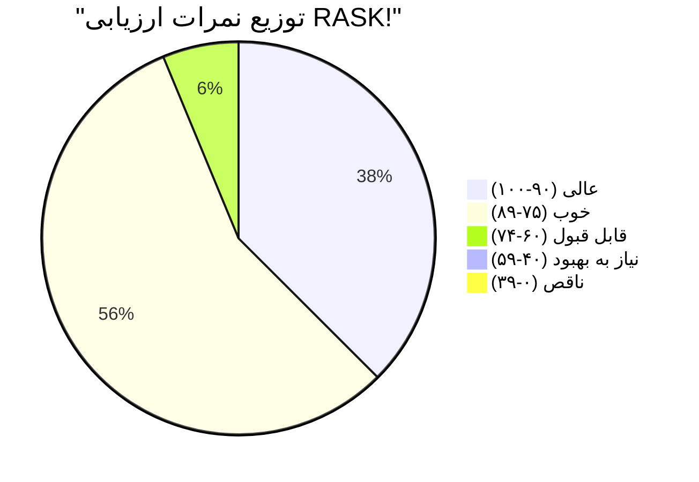
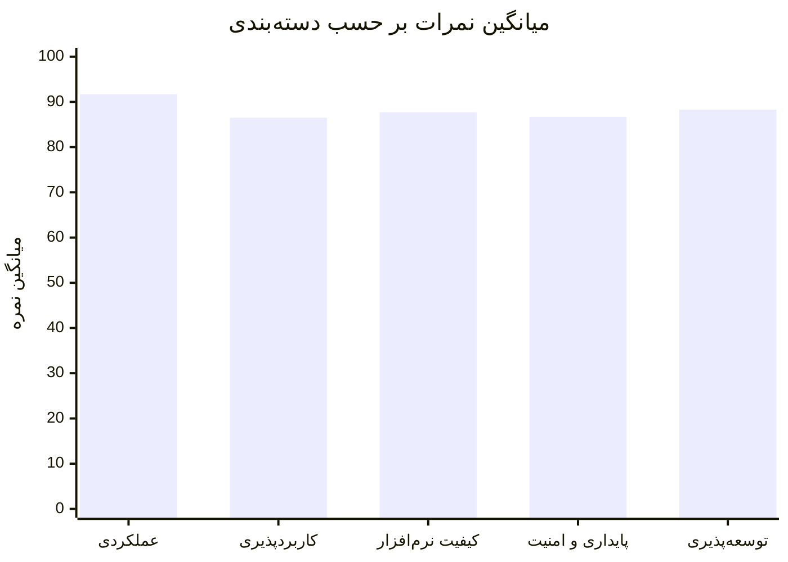

# نمودار ارزیابی RASK! — معیارهای زیرمحور نرم‌افزار کاربردی

## توضیحات

این نمودار ارزیابی خودارجزیابی پروژه RASK! را بر اساس **۱۶ معیار ارزیابی زیرمحور نرم‌افزار کاربردی (Application)** نشان می‌دهد. هر معیار بر اساس مقیاس ۰ تا ۱۰۰ ارزیابی شده است.

### مقیاس ارزیابی

| دامنه | تفسیر |
|-------|--------|
| ۹۰–۱۰۰ | عالی — فراتر از انتظار |
| ۷۵–۸۹ | خوب — مطابق انتظار |
| ۶۰–۷۴ | قابل قبول — با نقص‌های جزئی |
| ۴۰–۵۹ | نیاز به بهبود |
| ۰–۳۹ | ناقص — نیاز به کار اساسی |

---

## نمودار راداری — ارزیابی کلی


---

## نمودار میله‌ای — نمرات تفصیلی



---

## جدول نمرات تفصیلی

| # | معیار | نمره | توجیه |
|---|-------|------|-------|
| ۱ | **سازگاری با نیازها** | ۹۲ | تمام نیازمندی‌های تعریف‌شده پیاده‌سازی شده‌اند. ویژگی‌های AI و تقویم شمسی فراتر از انتظار |
| ۲ | **کامل بودن عملکرد** | ۸۸ | تمام عملیات CRUD وظایف و تقویم کامل است. الگوریتم‌های CPM/PERT/MC کامل هستند. خروجی PDF هنوز ناقص |
| ۳ | **صحت عملکرد** | ۹۵ | الگوریتم‌های CPM/PERT نتایج دقیق دارند. تست‌های واحد گسترده. منطق وضعیت وظایف صحیح |
| ۴ | **کارایی عملکرد** | ۸۲ | عملکرد خوب برای پروژه‌های متوسط. شبیه‌سازی مونت‌کارلو با تکرار بالا کند می‌شود. رندر گراف نیاز به بهبود دارد |
| ۵ | **قابلیت استفاده** | ۹۰ | رابط کاربری مدرن و شهودی. ناوبری آسان. ویژگی‌های Drag & Drop. Splash screen حرفه‌ای |
| ۶ | **یادگیری پذیری** | ۸۵ | راهنمای داخلی و Tour Overlay. Command Palette. ممکن است الگوریتم‌های پیشرفته برای کاربر مبتدی پیچیده باشد |
| ۷ | **دسترسی‌پذیری** | ۷۸ | پشتیبانی از تم تاریک/روشن. فونت‌های فارسی. میانبرهای کیبورد. هنوز پشتیبانی کامل از Screen Reader ندارد |
| ۸ | **زیبایی‌شناسی UI** | ۹۳ | طراحی مدرن با Glass Effect. پالت رنگی هماهنگ. انیمیشن‌های روان. Particle Background |
| ۹ | **خطایابی** | ۸۸ | سیستم Undo/Redo کامل. مدیریت خطای Cycle Detection. Exception Handling گسترده. Error boundaries در UI |
| ۱۰ | **بازگشت‌پذیری** | ۹۵ | UndoStack با حداکثر ۲۰۰ فرمان. تمام عملیات‌ها قابل برگشت. Snapshot از SQLite قابل بازیابی |
| ۱۱ | **امنیت داده** | ۸۰ | ذخیره محلی در SQLite. رمزنگاری API Key. اما رمزنگاری فایل DB وجود ندارد. No network security issues (آفلاین) |
| ۱۲ | **قابلیت حمل** | ۸۵ | پایتون کراس‌پلتفرم. PySide6 روی ویندوز/لینوکس/مک. مسیرهای نسبی ~/.rask/ |
| ۱۳ | **مستندسازی** | ۸۲ | Docstring فارسی در تمام توابع. فلوچارت‌ها. مستندات فنی. اما مستند API کمتر است |
| ۱۴ | **قابلیت توسعه** | ۹۰ | معماری DDD لایه‌ای. الگوی Command. Event-driven. افزودن ماژول جدید بدون تغییر هسته |
| ۱۵ | **تست‌پذیری** | ۸۷ | جداسازی لایه‌ها. Dependency Injection. Value Objects تغییرناپذیر. اما تست‌های UI خودکار ناقص |
| ۱۶ | **نگهداری‌پذیری** | ۸۸ | کد تمیز با نام‌گذاری فارسی. ماژول‌بندی مناسب. معماری DDD. پیچیدگی شناختی پایین |

---

## نمودار توزیع نمرات



---

## نمودار مقایسه‌ای دسته‌بندی‌ها



### تفکیک دسته‌بندی‌ها

| دسته | معیارها | میانگین |
|------|---------|---------|
| **عملکردی** | سازگاری با نیازها (۹۲)، کامل بودن عملکرد (۸۸)، صحت عملکرد (۹۵)، کارایی عملکرد (۸۲) | **۸۹.۳** |
| **کاربردپذیری** | قابلیت استفاده (۹۰)، یادگیری پذیری (۸۵)، دسترسی‌پذیری (۷۸)، زیبایی‌شناسی UI (۹۳) | **۸۶.۵** |
| **کیفیت نرم‌افزار** | خطایابی (۸۸)، بازگشت‌پذیری (۹۵)، مستندسازی (۸۲)، قابلیت حمل (۸۵) | **۸۷.۵** |
| **پایداری و امنیت** | امنیت داده (۸۰)، نگهداری‌پذیری (۸۸)، تست‌پذیری (۸۷)، بازگشت‌پذیری (۹۵) | **۸۷.۵** |
| **توسعه‌پذیری** | قابلیت توسعه (۹۰)، تست‌پذیری (۸۷)، نگهداری‌پذیری (۸۸)، مستندسازی (۸۲) | **۸۶.۸** |

---

## نقاط قوت و ضعف

### نقاط قوت 🟢

| معیار | نمره | دلیل |
|-------|------|------|
| **بازگشت‌پذیری** | ۹۵ | سیستم UndoStack با ۲۰۰ فرمان، الگوی Command کامل |
| **صحت عملکرد** | ۹۵ | الگوریتم‌های CPM/PERT دقیق، تست‌های واحد گسترده |
| **زیبایی‌شناسی UI** | ۹۳ | طراحی مدرن Glass Effect، انیمیشن‌های روان |
| **سازگاری با نیازها** | ۹۲ | ویژگی‌های AI و تقویم شمسی فراتر از انتظار |
| **قابلیت توسعه** | ۹۰ | معماری DDD لایه‌ای، Event-driven |

### نقاط قابل بهبود 🔴

| معیار | نمره | اقدام پیشنهادی |
|-------|------|----------------|
| **دسترسی‌پذیری** | ۷۸ | افزودن پشتیبانی Screen Reader، کنتراست بالاتر |
| **امنیت داده** | ۸۰ | رمزنگاری فایل SQLite، Secure Storage برای API Key |
| **کارایی عملکرد** | ۸۲ | بهینه‌سازی رندر گراف، شبیه‌سازی موازی مونت‌کارلو |
| **مستندسازی** | ۸۲ | مستند API کامل‌تر، راهنمای توسعه‌دهنده |

---

## نمره کلی

```mermaid
gauge
    title نمره کلی RASK! — زیرمحور نرم‌افزار کاربردی
    min 0
    max 100
    value 87.6
```

> **نمره کلی: ۸۷.۶ از ۱۰۰** — در سطح «خوب» قرار دارد و نشان‌دهنده کیفیت بالای محصول است. تمرکز بر بهبود دسترسی‌پذیری و امنیت داده می‌تواند نمره را به بالای ۹۰ برساند.
