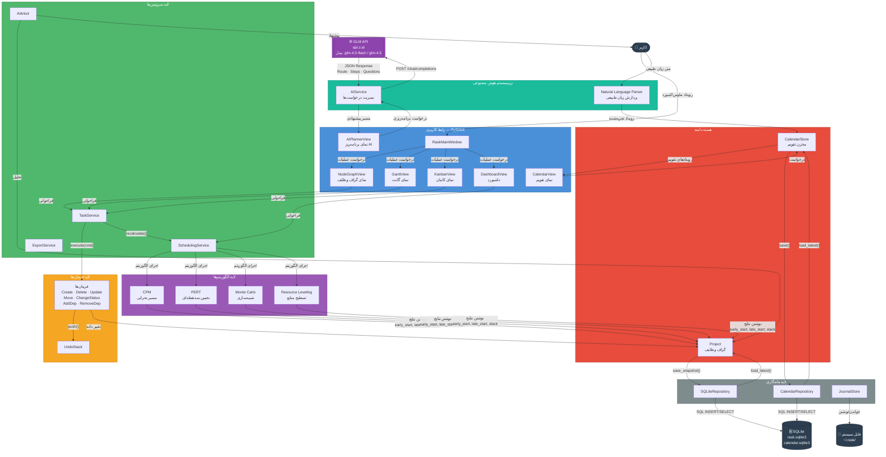
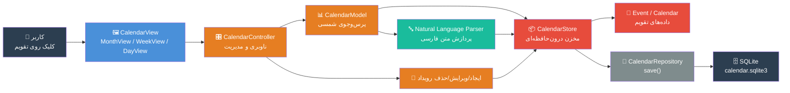
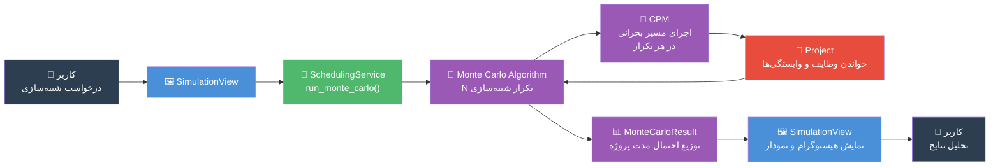

# نمودار جریان داده RASK! — Data Flow Diagram

## توضیحات

این نمودار نحوه جریان داده در سیستم RASK! را نشان می‌دهد. داده‌ها از ورودی کاربر آغاز شده، از طریق لایه‌های مختلف سیستم عبور می‌کنند و در نهایت در پایگاه داده SQLite ذخیره یا از API هوش مصنوعی دریافت می‌شوند. دو مسیر اصلی داده وجود دارد:

1. **مسیر مدیریت پروژه**: کاربر → UI → Services → Commands → Core Domain → Persistence
2. **مسیر هوش مصنوعی**: کاربر → UI → AIService → GLM API (z.ai)

---

## نمودار کلی جریان داده

---

## جریان داده: ایجاد و ویرایش وظیفه

```mermaid
graph LR
    A["👤 کاربر<br/>کلیک دکمه +"] --> B["🖼️ UI<br/>نمایش فرم"]
    B --> C["📝 TaskService<br/>create_task()"]
    C --> D["🔄 CreateTaskCommand<br/>execute()"]
    D --> E["💎 Project<br/>add_task()"]
    E --> F["📢 DomainEvent<br/>TaskCreated"]
    F --> G["🖼️ UI<br/>بروزرسانی نمایش"]
    C --> H["🧮 SchedulingService<br/>recalculate()"]
    H --> I["📐 CPM Algorithm<br/>run_cpm()"]
    I --> J["📊 نتایج CPM<br/>early_start, late_start, slack"]
    J --> K["💎 Project<br/>نوشتن نتایج در Task"]
    K --> L["📢 DomainEvent<br/>ScheduleRecalculated"]
    L --> G
    G --> M["💾 SQLiteRepository<br/>save_snapshot()"]
    M --> N["🗄️ SQLite Database"]

    style A fill:#2C3E50,color:#fff
    style B fill:#4A90D9,color:#fff
    style C fill:#50B86C,color:#fff
    style D fill:#F5A623,color:#fff
    style E fill:#E74C3C,color:#fff
    style F fill:#E74C3C,color:#fff
    style G fill:#4A90D9,color:#fff
    style H fill:#50B86C,color:#fff
    style I fill:#9B59B6,color:#fff
    style J fill:#9B59B6,color:#fff
    style K fill:#E74C3C,color:#fff
    style L fill:#E74C3C,color:#fff
    style M fill:#7F8C8D,color:#fff
    style N fill:#2C3E50,color:#fff
```

---

## جریان داده: برنامه‌ریزی هوشمند با AI

---

## جریان داده: عملیات Undo/Redo

```mermaid
graph LR
    A["👤 کاربر<br/>Ctrl+Z / Ctrl+Shift+Z"] --> B["🖼️ UI<br/>دریافت رویداد کیبورد"]
    B --> C["📝 TaskService<br/>undo/redo"]
    C --> D["🔄 UndoStack<br/>undo() / redo()"]
    D --> E["📋 Command<br/>undo() / redo()"]
    E --> F["💎 Project<br/>بازگشت به حالت قبلی"]
    F --> G["📢 DomainEvent<br/>بروزرسانی"]
    G --> H["🖼️ UI<br/>بروزرسانی نمایش"]
    H --> I["💾 SQLiteRepository<br/>ذخیره اسنپشات"]

    style A fill:#2C3E50,color:#fff
    style B fill:#4A90D9,color:#fff
    style C fill:#50B86C,color:#fff
    style D fill:#F5A623,color:#fff
    style E fill:#F5A623,color:#fff
    style F fill:#E74C3C,color:#fff
    style G fill:#E74C3C,color:#fff
    style H fill:#4A90D9,color:#fff
    style I fill:#7F8C8D,color:#fff
```

---

## جریان داده: تقویم و رویدادها

---

## جریان داده: شبیه‌سازی مونت‌کارلو

---

## خلاصه جریان‌های داده

| جریان | ورودی | خروجی | ذخیره‌سازی |
|-------|--------|--------|-----------|
| مدیریت وظایف | عملیات کاربر | بروزرسانی Project | SQLite snapshot |
| زمان‌بندی | داده‌های پروژه | نتایج CPM/PERT/MC | درون‌حافظه‌ای (روی Task) |
| هوش مصنوعی | اهداف + خلاصه پروژه | مسیر پیشنهادی | درون‌حافظه‌ای |
| تقویم | رویداد/ناوبری | بروزرسانی CalendarStore | SQLite snapshot |
| Undo/Redo | فرمان‌های اجرا‌شده | بازگشت به حالت قبلی | SQLite snapshot |
| خروجی | داده‌های پروژه | فایل CSV/JSON | فایل سیستم |
