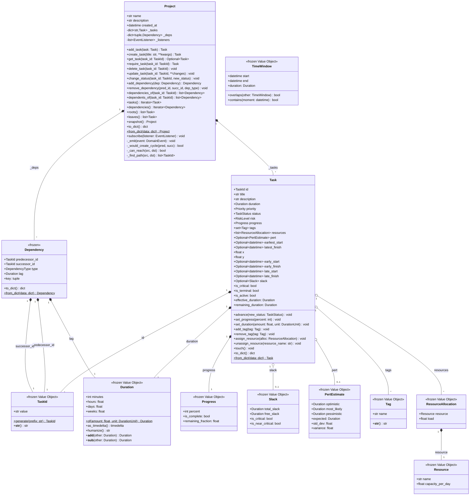
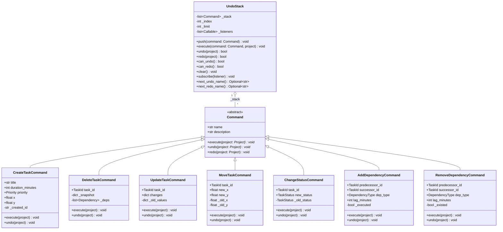
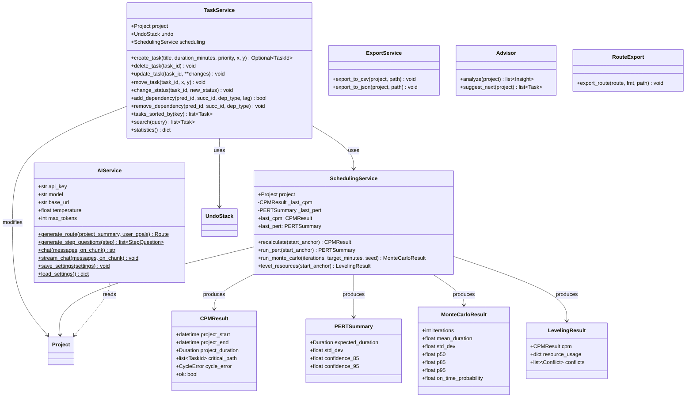
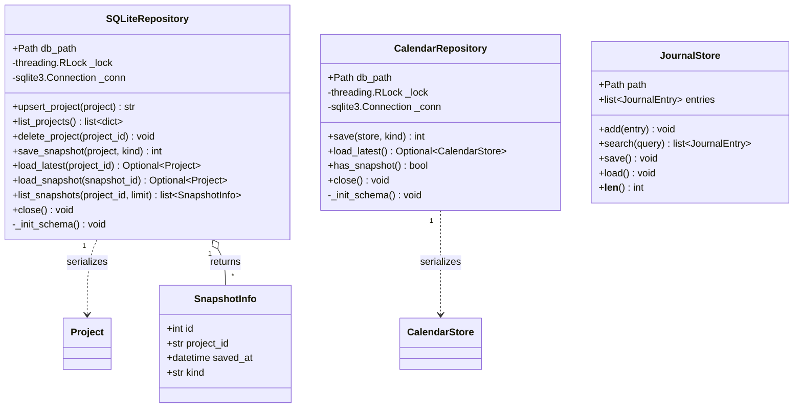
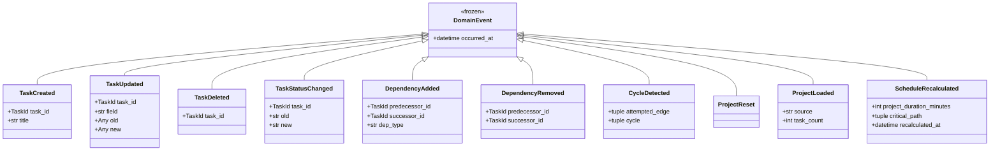
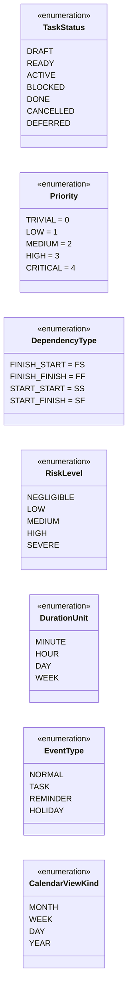

# نمودار کلاس RASK! — ساختار موجودیت‌ها و روابط

## توضیحات

این نمودار کلاس‌های اصلی سیستم RASK! را با روابط، ویژگی‌ها و متدهای کلیدی نشان می‌دهد. ساختار بر اساس الگوی **DDD** طراحی شده و موجودیت‌ها، اشیاء ارزشی، سرویس‌ها و فرمان‌ها را شامل می‌شود.

### راهنمای خواندن نمودار

- **◄——** ترکیب (Composition): چرخه حیات وابسته؛ والد بدون فرزند معنا ندارد
- **◇——** تجمیع (Aggregation): رابطه ضعیف‌تر؛ فرزند مستقل از والد وجود دارد
- **◁——** وراثت (Inheritance): کلاس فرزند از کلاس والد ارث‌بری می‌کند
- **..>** وابستگی (Dependency): استفاده موقت یا ارجاع

---

## نمودار کلاس‌های هسته دامنه (Core Domain)

---

## نمودار کلاس‌های فرمان (Commands)

---

## نمودار کلاس‌های سرویس و الگوریتم

---

## نمودار کلاس‌های زیرسیستم تقویم

```mermaid
classDiagram
    direction TB

    class CalendarStore {
        -dict~str,Calendar~ _calendars
        -dict~str,Event~ _events
        -list~StoreListener~ _listeners
        +add_calendar(calendar) Calendar
        +create_calendar(name, color, description) Calendar
        +get_calendar(cal_id) Optional~Calendar~
        +update_calendar(cal_id, **changes) void
        +set_calendar_visible(cal_id, visible) void
        +delete_calendar(cal_id) void
        +calendars() Iterator~Calendar~
        +visible_calendars() Iterator~Calendar~
        +add_event(event) Event
        +create_event(cal_id, title, start, end) Event
        +get_event(event_id) Optional~Event~
        +update_event(event_id, **changes) void
        +delete_event(event_id) void
        +events() Iterator~Event~
        +events_in_range(start, end) list~Event~
        +events_on_day(day) list~Event~
        +upcoming_events(days) list~Event~
        +search(query) list~Event~
        +subscribe(listener) void
        +to_dict() dict
        +from_dict(data) CalendarStore$
    }

    class Calendar {
        +str id
        +str name
        +str color
        +str description
        +bool is_default
        +bool visible
        +create(name, color, description) Calendar$
        +to_dict() dict
        +from_dict(data) Calendar$
    }

    class Event {
        +str id
        +str calendar_id
        +str title
        +str description
        +str location
        +datetime start
        +datetime end
        +bool all_day
        +EventType event_type
        +EventStatus status
        +Optional~str~ color
        +Optional~RecurrenceRule~ recurrence
        +list~Attendee~ attendees
        +list~Reminder~ reminders
        +bool completed
        +move_to(new_start) void
        +set_time(start, end) void
        +overlaps(start, end) bool
        +is_recurring: bool
        +duration: timedelta
        +to_dict() dict
        +from_dict(data) Event$
    }

    class RecurrenceRule {
        +str frequency
        +int interval
        +Optional~int~ count
        +Optional~datetime~ until
        +expand(event_start, range_start, range_end) Iterator~datetime~
    }

    class CalendarModel {
        +CalendarStore store
        +calendars() list~Calendar~
        +visible_calendars() list~Calendar~
        +events_on_day(shamsi) list~Event~
        +events_in_shamsi_range(start, end) list~Event~
        +events_in_month(year, month) list~Event~
        +events_in_week(containing) list~Event~
        +day_events(shamsi) DayEvents
        +compute_timed_layout(events) list~EventLayout~
        +month_grid(year, month) list
        +create_event(cal_id, title, start, end) Event
        +update_event(event_id, **changes) void
        +delete_event(event_id) void
        +move_event(event_id, new_start) void
        +resize_event(event_id, new_end) void
        +search(query) list~Event~
    }

    class CalendarController {
        +CalendarModel model
        +SelectionManager selection
        +CalendarViewKind view_kind
        +ShamsiDate nav_date
        +Signal view_changed
        +Signal date_changed
        +Signal events_changed
        +set_view(kind) void
        +go_today() void
        +go_next() void
        +go_prev() void
        +go_to_date(d) void
        +create_event_at(start, end, title, all_day) Event
        +create_event_from_nl(text) Event
        +move_event(event_id, new_start) void
        +resize_event(event_id, new_end) void
        +delete_event(event_id) void
        +toggle_event_completed(event_id) void
    }

    class DayEvents {
        +ShamsiDate date
        +list~Event~ all_day
        +list~Event~ timed
        +list~EventLayout~ timed_layout
    }

    class EventLayout {
        +Event event
        +float left
        +float width
        +int column
        +int total_columns
    }

    CalendarStore "1" *-- "*" Calendar : _calendars
    CalendarStore "1" *-- "*" Event : _events
    Event "1" o-- "0..1" RecurrenceRule : recurrence
    CalendarModel "1" *-- "1" CalendarStore : store
    CalendarController "1" *-- "1" CalendarModel : _model
    DayEvents "1" o-- "*" EventLayout : timed_layout
    EventLayout "1" *-- "1" Event : event
```

---

## نمودار کلاس‌های ماندگاری (Persistence)

---

## نمودار رویدادهای دامنه (Domain Events)

---

## نمودار شمارش‌ها (Enums)

