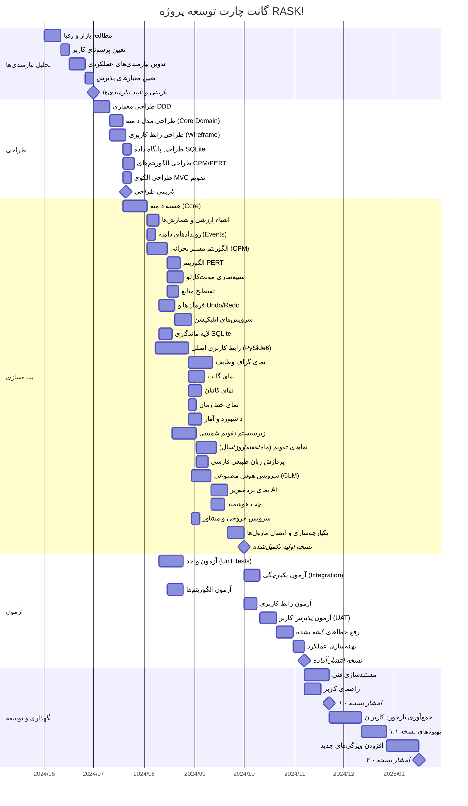
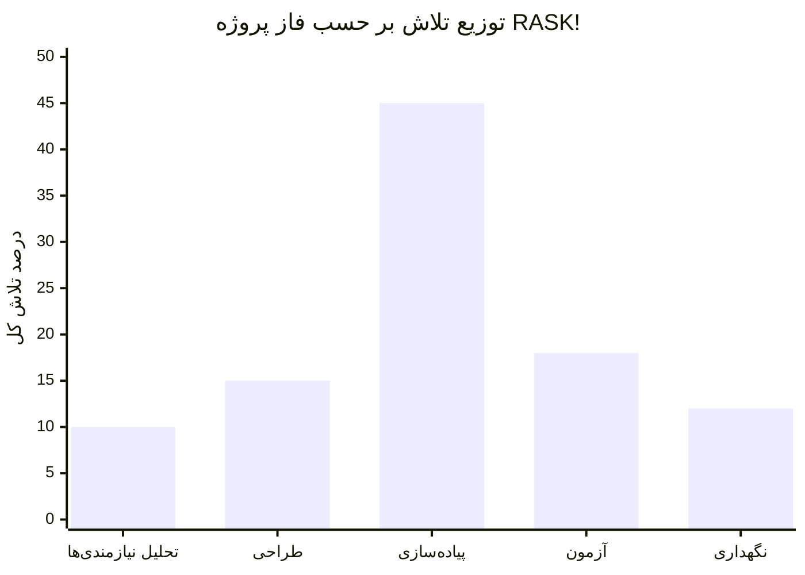

# گانت چارت پروژه RASK! — زمان‌بندی توسعه

## توضیحات

این نمودار گانت، زمان‌بندی توسعه پروژه RASK! را نشان می‌دهد. پروژه در ۵ فاز اصلی اجرا شده است:

1. **تحلیل نیازمندی‌ها**: مطالعه نیازهای کاربر و تعیین ویژگی‌های محصول
2. **طراحی**: طراحی معماری، رابط کاربری و پایگاه داده
3. **پیاده‌سازی**: کدنویسی ماژول‌ها و ویژگی‌ها
4. **آزمون**: تست واحد، تست یکپارچگی و تست پذیرش
5. **نگهداری**: رفع خطا، بهبود عملکرد و افزودن ویژگی‌های جدید

---

## گانت چارت

---

## نمودار فشار کاری (Workload)

---

## خلاصه فازها

| فاز | مدت تقریبی | تعداد فعالیت‌ها | خروجی کلیدی |
|-----|-----------|----------------|------------|
| **تحلیل نیازمندی‌ها** | ۴ هفته | ۴ | سند نیازمندی‌ها، معیارهای پذیرش |
| **طراحی** | ۵ هفته | ۶ | معماری DDD، Wireframe، طرح DB |
| **پیاده‌سازی** | ۲۰ هفته | ۲۴ | ماژول‌های عملیاتی کامل |
| **آزمون** | ۱۰ هفته | ۷ | گزارش تست، نسخه پایدار |
| **نگهداری** | ۱۸ هفته | ۶ | نسخه‌های ۱.۰، ۱.۱، ۲.۰ |

---

## نقاط عطف (Milestones)

| نقطه عطف | تاریخ تقریبی | توضیح |
|----------|-------------|-------|
| **m1** — تأیید نیازمندی‌ها | هفته ۴ | تکمیل و تأیید سند نیازمندی‌ها |
| **m2** — تأیید طراحی | هفته ۹ | تکمیل معماری و طراحی‌ها |
| **m3** — نسخه اولیه | هفته ۲۹ | تکمیل پیاده‌سازی تمام ماژول‌ها |
| **m4** — نسخه انتشار | هفته ۳۹ | تکمیل آزمون‌ها و آماده انتشار |
| **m7** — نسخه ۱.۰ | هفته ۴۲ | انتشار عمومی نسخه ۱.۰ |
| **m11** — نسخه ۲.۰ | هفته ۵۷ | انتشار نسخه ۲.۰ با ویژگی‌های جدید |
